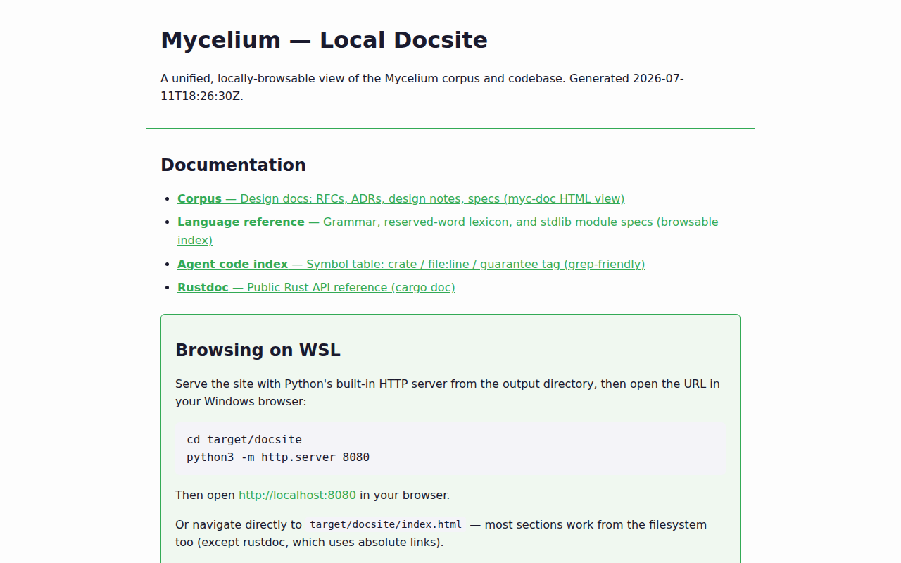

# Mycelium

> A **fast, memory-safe, ergonomic** multi-paradigm language that treats **traditional binary**,
> **balanced ternary**, **dense embeddings**, and **Vector Symbolic Architectures (VSA /
> hyperdimensional computing)** as co-equal, first-class substrates — under semantics that are
> **transparent** (no hidden behavior) and **metadata-native**, with **certification & auditability
> baked in as *optional, tunable* capabilities** (`fast` by default · `certified` on request)
> rather than a tax on every line.

**Status:** design + **Rust-first implementation underway, now expanding into Mycelium self-hosting.**
The design corpus spans Foundation, RFC-0001…0041, ADR-001…044, DN-01…89 — per-document status (Draft / Proposed / Accepted /
Enacted / Resolved) is in [`docs/Doc-Index.md`](docs/Doc-Index.md). The Rust workspace has
**56 crates** (+ `xtask`) <!-- doc-currency:crate-count --> — a trusted reference interpreter,
explicit representation **swaps** (certified at the `certified` mode), the selection-policy
engine, a verified-numerics layer, a **Rust-first standard library**, an L1 surface with
**generics · traits · higher-order functions · operator syntax**, a **runtime** (scheduler,
structured concurrency) with a **three-layer hybrid memory model**, and a **native AOT compiler**
(`crates/mycelium-mlir`) that now lowers recursion, closures, `Swap`, Dense, and VSA — landed
(epic E25-1), with full-language coverage still in progress (ADR-034). Per the transparency rule,
no claim here is upgraded beyond what a checked basis supports (VR-5). See
[Status & roadmap](docs/guide/status-and-roadmap.md) for the honest, itemized state of every
in-progress piece.

> **Direction note (ADR-032, Enacted 2026-06-24).** The north star has been **repositioned** from
> the original "certified-everything substrate" premise toward **a fast, memory-safe, ergonomic
> multi-paradigm language**, with certification/transparency as **optional, tunable** capabilities
> (RFC-0034: `fast` default · `balanced` · `certified`). Memory-safety, speed, and ergonomics are
> now **first-class goals** alongside the transparent-swap thesis. The "honesty rule" is reframed
> as the **transparency & auditability rule** (mechanism unchanged — see
> [Guarantees & verification](docs/guide/guarantees-and-verification.md)).
>
> **Direction note (ADR-042 / ADR-043, Accepted 2026-07-07).** The project has committed to **full
> Mycelium self-hosting**: freeze the Rust base and progressively rewrite **everything — kernel,
> toolchain, and codegen backend included — to Mycelium** ("zero foreign first-party languages"),
> retiring each Rust component **only once proven** by a dual witness (the Rust differential plus the
> native `myc` toolchain) and archiving it to a protected legacy branch (never lost). This is the
> direction, actively underway (see status below), not a completed migration — every claim stays
> tagged to its checked basis (VR-5).
>
> **Temporary whole-project unfreeze (ADR-045, Accepted 2026-07-10).** The NOW-horizon freeze above —
> plus the L0 Core IR floor, the L1 kernel primitive/type set, the L2/L3 surface grammar, and the
> stdlib "lexicon" — is **lifted for a bounded, re-freezable gap-closure window**, so the language can
> close its expressibility gaps early rather than after the stdlib fans out into per-component repos.
> The ADR-042 END-STATE above is **unchanged**; re-freeze is bound to the DN-99 residual worklist
> (see [ADR-045](docs/adr/ADR-045-Kernel-And-Lexicon-Unfreeze-For-Early-Gap-Closure.md)).

---

## Contents

- **[Companion guide](docs/companion/README.md)** — **start here for humans**: thematic maps
  (not DN numeric order), guarantee **airlocks**, memory as one lifecycle, three trust axes,
  Mermaid diagrams. Non-normative curator over the corpus.
- [Why this exists, and the core ideas](docs/guide/why-and-design.md)
- [Guarantees & verification](docs/guide/guarantees-and-verification.md) — the
  `Exact ⊐ Proven ⊐ Empirical ⊐ Declared` lattice and the split verification regime
- [Workspace map](docs/guide/workspace-map.md) — all 56 crates, the proof artifacts, the
  LLM-leverage experiment
- [How Mycelium compares](docs/guide/comparisons.md) — vs. typed systems languages, ML/array
  languages, VSA/HDC libraries, verification-oriented languages
- [Repository structure](docs/guide/repository-structure.md) — the directory map
- [Docsite preview](docs/guide/docsite-preview.md) — screenshots of the themed, light/dark,
  syntax-highlighted local docsite, and how to build/regenerate it
- [Status & roadmap](docs/guide/status-and-roadmap.md) — what's built, what's in progress
  (including the native AOT state), the technology stack
- [Decisions & reading order](docs/guide/decisions-and-reading-order.md) — load-bearing table +
  path via companion themes then selective RFCs
- [Glossary (README scope)](docs/guide/glossary.md) — short local terms; the canonical lexicon is
  [`docs/Glossary.md`](docs/Glossary.md)
- [Contributing conventions & provenance](docs/guide/contributing-and-provenance.md) — the short
  version; full process in [`CONTRIBUTING.md`](CONTRIBUTING.md)

Other key entry points: [`docs/Mycelium_Project_Foundation.md`](docs/Mycelium_Project_Foundation.md)
(the charter), [`docs/Doc-Index.md`](docs/Doc-Index.md) (the whole-corpus map),
[`docs/CURRENT-STATE.md`](docs/CURRENT-STATE.md) (fast "what's true now"), and
[`CLAUDE.md`](CLAUDE.md) (the operating guide / house rules for agents working in this repo).

---

## See it

The design corpus (RFCs/ADRs/DNs/specs), the agent code index, and rustdoc render into one themed,
light/dark, syntax-highlighted local docsite (`just docs-site`) — the screenshots below are the
docsite's genuine output, both themes, captured by `scripts/docs-assets.sh`
(full preview + how it's regenerated: [Docsite preview](docs/guide/docsite-preview.md)).

<picture>
  <source media="(prefers-color-scheme: dark)" srcset="docs/assets/docsite-home-dark.png">
  <source media="(prefers-color-scheme: light)" srcset="docs/assets/docsite-home-light.png">
  
</picture>

A GitHub Pages deployment (`.github/workflows/publish-docs.yml`) is wired up to publish this same
build to `https://tzervas.github.io/mycelium/` — **deploying, not yet confirmed live** as this README
is written; if the link 404s, the workflow hasn't run against `main` yet. The design corpus is also
available as a curated PDF set (Typst-rendered, NotebookLM-shaped clusters + a chapter-ordered book):
[the `docs-notebooklm-2026-07-11` release](https://github.com/tzervas/mycelium/releases/tag/docs-notebooklm-2026-07-11).

## In practice — two real `.myc` fragments

Both fragments below are the actual, committed example phyla in [`examples/`](examples/) and are
**checked clean by the real toolchain** — `cargo run -p mycelium-cli --bin myc -- check` reports
`myc: 2 nodule(s) checked clean` / `myc: 4 nodule(s) checked clean` for `hello-phylum`/`repr-tour`
respectively (verified for this README; re-run it yourself, nothing here is asserted-only).

A minimal nodule — a binary literal and a `let`-binding
([`examples/hello-phylum/hello.myc`](examples/hello-phylum/hello.myc)):

```mycelium
nodule hello;

fn one() => Binary{8} =
  0b0000_0001;

fn two() => Binary{8} =
  let x = 0b0000_0001 in x;
```

The representation-swap thesis, in the language itself — every swap is explicit, and its guarantee
tag is part of the function signature, never inferred or asserted after the fact
([`examples/repr-tour/swaps.myc`](examples/repr-tour/swaps.myc)):

```mycelium
nodule tour.swaps;

fn widen(x: Binary{8}) => Ternary{6} @ Declared =
  swap(x, to: Ternary{6}, policy: roundtrip);

fn narrow(x: Dense{768, F32}) => Dense{768, BF16} @ Empirical =
  swap(x, to: Dense{768, BF16}, policy: bf16_round);

fn certified(x: Dense{768, F32}) => Dense{768, BF16} @ Proven =
  swap(x, to: Dense{768, BF16}, policy: bf16_round);
```

Three signatures, three honestly different guarantee tags (this is a syntax demonstration, not a
claim about what each specific swap "really" deserves — `narrow`/`certified` show the same
BF16-rounding call at two assurance levels: `@ Empirical` when only trial data backs the ε bound,
`@ Proven` only once the cited theorem's side-conditions are checked). That's the
`Exact ⊐ Proven ⊐ Empirical ⊐ Declared` lattice (house rule 1) written into the type, not just
claimed in prose — full treatment: [Guarantees & verification](docs/guide/guarantees-and-verification.md).
More worked examples, including traits and bounded iteration: `examples/repr-tour/`.

## Why this exists, in one paragraph

Modern computing keeps four representation families in separate worlds: bits for traditional
computation, dense embeddings for ML, hypervectors for symbolic-connectionist work, and balanced
ternary as a recurring "what if" in hardware. Moving between them is where correctness quietly
leaks — conversions are implicit, lossy in undocumented ways, and impossible to audit. Mycelium's
thesis is that the **representation-swap** should be the explicit, verifiable, first-class
operation of the language. Full rationale and the core design commitments:
[Why & design](docs/guide/why-and-design.md).

## The core ideas, at a glance

- **Representation is part of the type** — `Binary{width}`, `Ternary{trits}`, `Dense{dim,dtype}`,
  `VSA{model,dim,sparsity}` are distinct type families; there is **no implicit conversion**.
- **`Swap` is the only representation-changing operation**, and every swap emits a certificate
  describing exactly what the conversion cost.
- **Transparency is a typed, monotone property** — the guarantee lattice
  `Exact ⊐ Proven ⊐ Empirical ⊐ Declared` travels with every value and only ever degrades.
- **Selection policies are reified, `EXPLAIN`-able artifacts** — no black-box "intelligent"
  behavior anywhere in the kernel.
- **Definitions are content-addressed** — identity is the content hash; names are metadata.

Full detail: [Why & design](docs/guide/why-and-design.md). Repository layout at a glance:
[Repository structure](docs/guide/repository-structure.md).

## Quickstart

```sh
just              # list recipes
just setup        # best-effort install of the check tools
just check-canary # fast per-promotion gate — all gates + change-scoped Tier-0 tests
just check        # Tier-1 CI gate — change-scoped tests (+ reverse-deps, LOW proptest) + all gates
just check-full   # Tier-2 durability sweep (full workspace, HIGH proptest, mutants, fuzz) — periodic/desktop
just fmt          # auto-format (Rust + Python)
just docs-index   # regenerate docs/api-index/ after a public-API change
```

Checks **skip gracefully** when a tool isn't present. Remote CI
(`.github/workflows/checks.yml`) is **manual-dispatch only and advisory**, running the same
`just ci` — see [`CONTRIBUTING.md`](CONTRIBUTING.md).

Worked examples live in [`examples/`](examples/) (`hello-phylum`, `repr-tour`); the reference
interpreter and kernel are in [`crates/mycelium-interp`](crates/mycelium-interp/README.md) and
[`crates/mycelium-core`](crates/mycelium-core/README.md) — see the
[workspace map](docs/guide/workspace-map.md) for the full crate-by-crate tour.

## What is built (short version)

The Core IR + Rust reference interpreter; the certified binary↔ternary swap (Z3-proved); the
verified-numerics layer; Dense/VSA breadth with per-model guarantee matrices; the
selection-policy engine + EXPLAIN; a **native AOT compiler** covering recursion, closures,
`Swap`, Dense, and VSA (epic E25-1, `Empirical` via a checked three-way differential); JIT
including dynamic-VSA/HDC JIT; hot-inject; the L1 surface (generics/traits/effects); the
runtime/concurrency model with a three-layer hybrid memory model; the full toolchain suite; and a
Rust-first standard library (25/25 crate specs `Accepted`). Full crate-by-crate detail:
[Workspace map](docs/guide/workspace-map.md). Full honest status (including what's still open on
the AOT full-coverage gate, ADR-034): [Status & roadmap](docs/guide/status-and-roadmap.md).

**In progress (the committed direction — ADR-042/ADR-043):** full Mycelium self-hosting. The
compiler **frontend port is underway** in [`lib/compiler/*.myc`](lib/compiler/) — lexer, parser,
AST, and the semantic core (via the boot10 / M-993 port ladder), each dual-witnessed by the Rust
differential **and** the native `myc check` (M-989). Full **kernel + stdlib + backend** self-hosting,
and surface-language ratification, remain in progress toward the `1.0`/`1.x` capstone — landed
increments are graded `Empirical`, not-yet-discharged obligations stay `Declared` (VR-5).

---

## License

MIT — Copyright (c) 2026 **Tyler Zervas**. See [`LICENSE`](./LICENSE).
