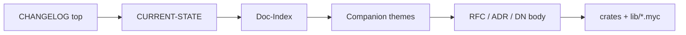

# How to read Mycelium — resolution chain and thematic order

## The practical resolution path

For any "what is true *now*?" question:

1. **Top of `CHANGELOG.md`** — freshest landings (wins if `CURRENT-STATE` lags).
2. **`docs/CURRENT-STATE.md`** — dense pointer index.
3. **`docs/Doc-Index.md`** — authoritative per-document status + dependencies.
4. **This companion** — *why those documents complete each other* (thematic).
5. **The numbered RFC/ADR/DN** — the permanent decision body (append-only).

Numeric order in `docs/notes/DN-*.md` is **history**. Thematic order here is
**comprehension**. Both are needed: history is architecture; architecture still
needs a curator for the human reader.

## Two axes of the bookshelf

| Axis | What you get | Where |
|---|---|---|
| **Chronological / append-only** | What was decided, in what order, with what basis | `docs/rfcs/`, `docs/adr/`, `docs/notes/` |
| **Thematic / capability** | How ideas interlock, what problem cluster they close | **this directory** |

You are never asked to choose: the companion always deep-links into the numbered
corpus. If a theme and a Doc-Index status disagree, **Doc-Index wins** (VR-5).

## Suggested first-hour path (human or agent)

1. [01 — Thesis & tower](01-thesis-and-tower.md) — the one-sentence thesis and the layers.
2. [04 — Three trust axes](04-three-trust-axes.md) — guarantee · cert mode · typing strictness.
3. [02 — Guarantee airlocks](02-guarantee-airlocks.md) — how not to poison a pipeline.
4. [03 — Memory lifecycle](03-memory-as-lifecycle.md) — affine → RC → region as one story.
5. [05 — Thematic decision map](05-thematic-decision-map.md) — ADR-045 window as achievements.
6. [06 — Expressibility & transpile](06-expressibility-and-transpile.md) — what remains for one-shot port.

Then: `docs/guide/why-and-design.md` → `docs/Mycelium_Project_Foundation.md` →
the RFCs named in each companion chapter.

## Project-management docs (grouped, not by id)

| Cluster | Purpose | Entry points |
|---|---|---|
| **Charter & release** | Vision, gates, versioning | Foundation; ADR-022/032/036/038; ADR-018 |
| **Kernel & honesty** | L0/L1, lattice, swaps | RFC-0001…0004; ADR-001…011 |
| **Memory & runtime** | Reclamation, concurrency | RFC-0027/0008; DN-32/33; RFC-0041 |
| **Surface & stdlib** | Grammar, ports | RFC-0030/0037/0016; DN-119…140 |
| **Self-host & transpile** | Rust→`.myc`, freeze | ADR-042/043/045; M-991; gap analysis |
| **Tooling & PM** | Issues, CI, skills | `tools/github/`; `CLAUDE.md`; DN-97 |

## Supersession without archaeology

Accepted ≠ built. An Accepted DN ratifies a *design*; mechanism claims stay
`Declared` until landed and differential-witnessed, then the status row appends
toward Enacted. The companion flags **landed vs open** at the theme level;
always re-check Doc-Index before claiming Enacted.
