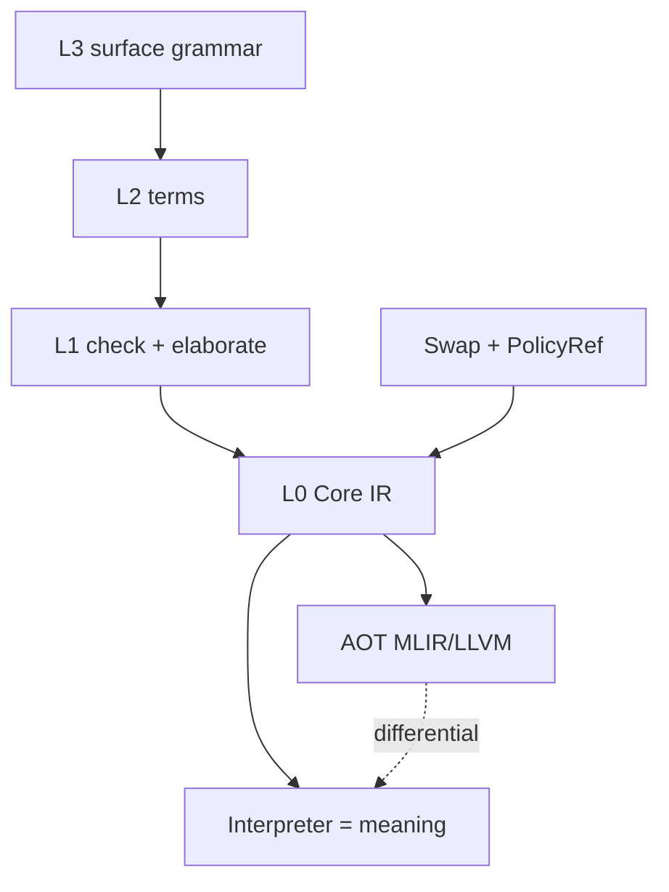

# Thesis and tower — what Mycelium is

> Distilled from the 2026-07-16 analysis pack and the in-tree guide corpus.
> Normative anchors: `docs/guide/why-and-design.md` · RFC-0001 · ADR-032.

## The thesis (one paragraph)

Modern systems keep four representation families in walled gardens — **bits**,
**balanced ternary**, **dense embeddings**, and **VSA hypervectors**. Correctness
dies in the *conversion*: implicit, lossy, unauditable. Mycelium makes the
**representation swap** the explicit, first-class, certifiable operation, and
makes every approximation **disclosed, bounded, and strength-tagged**.

North star (ADR-032, Enacted): a fast, memory-safe, ergonomic multi-paradigm
language; certification is optional and tunable (`fast` default · `certified` on
request). The honesty rule became the **transparency and auditability** rule —
mechanism unchanged (VR-5, G2).

## Functional value semantics (load-bearing, not flavor)

Values are immutable, identity is structural (content-addressed), and programs
compose pure transforms. That is what licenses:

- the three-layer memory model without a borrow checker ([03](03-memory-as-lifecycle.md));
- content-addressed spores and provenance DAGs;
- equational reasoning under the guarantee lattice ([02](02-guarantee-airlocks.md)).

## Layered tower

| Layer | Role | Trusted? |
|---|---|---|
| **L0 Core IR** | Tiny node grammar; `Swap` only rep-change node (mandatory policy) | Yes — `mycelium-core` |
| **Interpreter** | Reference meaning (small-step CBV) | Yes — `mycelium-interp` |
| **L1** | Types, traits, HOF via static defunctionalization, elaborate → L0 | Yes — `mycelium-l1` |
| **L2/L3** | Surface term + concrete grammar | Frontend |
| **AOT / MIR** | MLIR→LLVM; RC elision | **Untrusted** optimizers; differential vs interpreter |
| **stdlib / toolchain** | Rust-first + `.myc` ports; `myc check` / transpile | Witnessed ports |

## Crates as strata

Dependency strata (`deps-strata.toml`) refuse cycles. VSA algebra is opt-in;
kernel only type-checks hypervector *mentions*. See [diagrams — crate strata](diagrams.md#crate-strata).

## Self-hosting vector

ADR-042/043: freeze Rust base, rewrite to Mycelium under dual witness, archive
never delete. ADR-045: bounded unfreeze for expressibility gap-close. Transpile
is the **profiler** for that program (M-991), not a silent bulk porter
([06](06-expressibility-and-transpile.md)).
