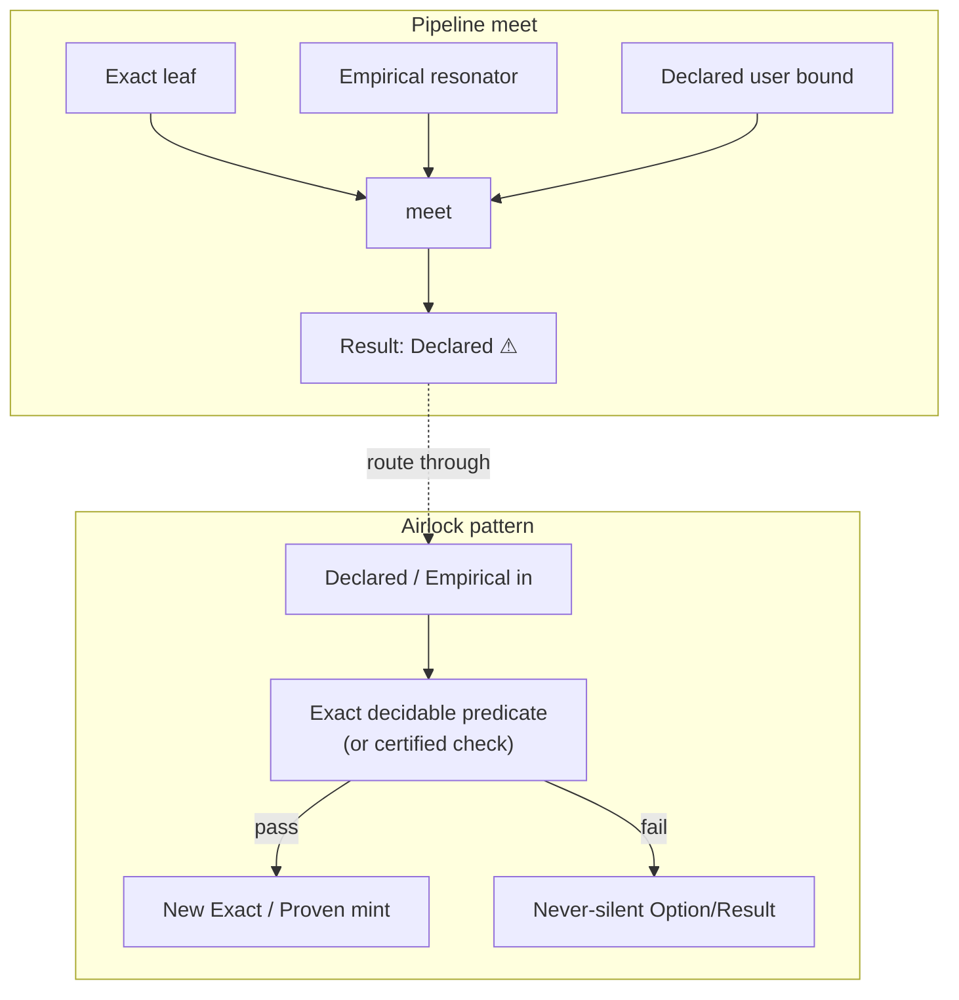

# Guarantee airlocks — surviving weakest-wins without poisoning the plant

> **Audio critique (2026-07-16):** the lattice is elegantly specified; the missing
> piece is *developer friction* — how to isolate, quarantine, and recertify
> `Declared` so one bare assertion does not strip a whole pipeline. This chapter
> is that guide. Normative lattice: RFC-0001 · ADR-001 · VR-5 · G2.

## The rule (math first, then the cleanroom)

Every value's `Meta` carries a strength on:

\[
\mathrm{Exact} \sqsupset \mathrm{Proven} \sqsupset \mathrm{Empirical} \sqsupset \mathrm{Declared}
\]

Composition is the lattice **meet** (weakest-wins). Disclosure may **degrade**;
it may never **silently upgrade**. That pessimism is intentional: a
`Declared` leaf is unsterilized dust in a cleanroom. The documentation must
still teach the **airlock**.



## Feature, not bug — but still document the airlock

A language designer can honestly say: pipeline contamination *should* hurt, so
teams replace `Declared` with measured or proven bases. That stance is compatible
with Mycelium's thesis. **Even so**, the docs must show:

1. How contamination propagates (meet).
2. How to wall it (module / cert-mode / recertify boundary).
3. What the engineer types (patterns below — some landable today, some `Declared` roadmap).

## Pattern catalogue

### A — Cert-mode firewall (landed machinery)

**Idea:** run exploratory work under `@certification(fast)` (or nodule ambient)
and only promote into a `certified` consumer after a boundary that *checks*.

| Piece | Role |
|---|---|
| RFC-0034 / ADR-032 | `fast` · `balanced` · `certified` modes |
| Mode in `Meta` | never-silent which tier produced the value |
| Mode ∉ content hash | switching mode does not rewrite identity |

**Workflow:** junior / ML research path stays in `fast`/`balanced` where emission
may not fully check; production kernels demand `certified` and refuse to meet
unchecked claims into their signature without an explicit boundary.

### B — Module sea-wall (design pattern)

```text
// conceptual — shape of an airlock nodule
// nodule: std.airlock.example

// Accepts a weakly tagged payload; only returns Exact if an Exact predicate holds.
fn seal_width(x: Binary{64} @ Declared) => Option[Binary{64} @ Exact] =
  match lt(x, 0b1_0000_0000) {   // Exact decidable predicate on the bits
    0b1 => some(x),              // re-mint under Exact (bound discharged by check)
    _   => none                  // never silent success
  }
```

**What this is doing:** the meet into the *caller of `seal_width`* sees `Option`
(failure is explicit). The success path is a **new** value whose tag is justified
by a total check, not by hoping the caller's `Declared` was lucky.

Honesty: the concrete prelude helpers and syntax sugar for "re-mint tag" remain
tooling-dependent — treat the snippet as **pattern**, not a frozen API, until a
stdlib airlock phylum is ratified. The *discipline* is enforceable today with
explicit `Option`/`Result` and never-silent gaps in the transpiler.

### C — Swap + reconstruction manifest (lossy → bounded)

For Dense/VSA paths (RFC-0002 / RFC-0003): do not pretend an `Empirical`
resonator output is `Exact`. Attach a **reconstruction manifest** / policy ref
so EXPLAIN shows *indexed retrieval* vs *compositional reconstruction*. The
airlock is the typed policy, not a silent cast.

### D — Organizational quarantine

| Practice | Effect |
|---|---|
| CI / review: flag new `@ Declared` on `main` paths | junior cannot silently strip Proven cores |
| Phylum boundary: `pub` API only exports meet-safe tags | dust stops at the crate edge |
| Spore packaging: certify only content-addressed certified graphs | deploy unit is the cleanroom export |

## Concrete scenario (ML → structural Exact)

1. Resonator factorization yields `Hypervector @ Empirical` (FR-C2: resonator
   capped Empirical by construction).
2. Downstream wants a structural `Datum` composite that only accepts `Exact`
   field guarantees for a safety-critical branch.
3. **Wrong:** pass the hypervector through and hope meet stays high.
4. **Right:** either
   - keep the critical branch on a **separate Exact path** (no meet with the
     Empirical leaf), or
   - airlock: decode / threshold / validate with an Exact predicate into a
     codebook atom (`indexed retrieval` — bounded-lossy, honest type), then
     construct the Datum from that atom.

Show the *syntax intent*: never a silent `as Exact`. Prefer `match` plus
`Option` plus EXPLAIN-able policy.

## Counter-argument held

"If we document airlocks, teams will launder Declared forever." Mitigations:

- Airlocks that mint higher tags must cite a **basis** (predicate, certificate,
  trial count) — VR-5; tooling should refuse tag upgrade without basis.
- Prefer **recertify-with-evidence** over **assert-stronger**.

## See also

- [04 — Three trust axes](04-three-trust-axes.md)
- [diagrams — lattice meet](diagrams.md#guarantee-lattice)
- Normative: RFC-0001 metadata · ADR-011 bound basis · ADR-032 modes
