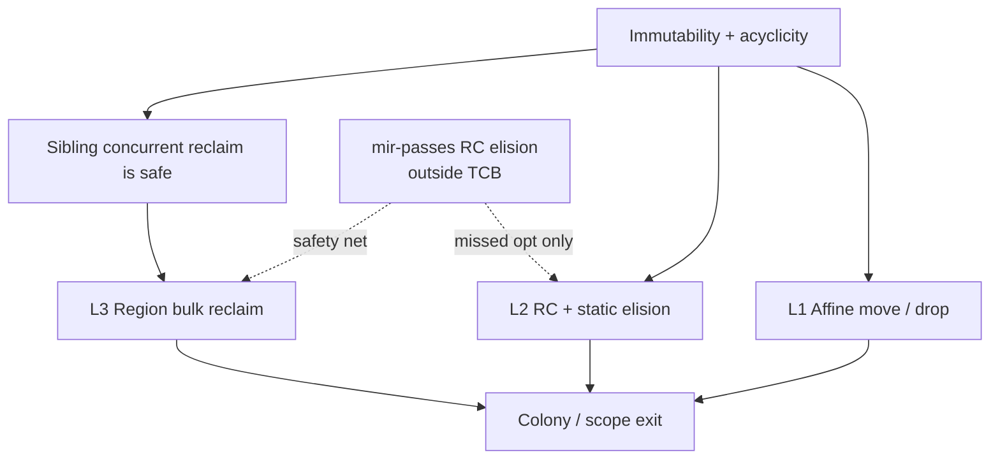

# Memory as one lifecycle — L1 · L2 · L3 are not three products

> **Audio critique:** Layers 1–2 already answer "Rust-grade safety without a
> borrow checker." Layer 3 currently *reads* like an appendix. Reframe it as the
> **macro environment** that orchestrates fallout from L1/L2, anchored in
> acyclicity and structured concurrency. Normative: RFC-0027 · DN-32 · DN-33 ·
> RFC-0008 (RT1–RT7).

## The through-line

Immutability ⇒ **cycles unconstructible** ⇒ Perceus garbage-free RC is sound ⇒
regions can tear down **sibling** scopes concurrently because **no cross-sibling
aliases exist**. Layer 1's guarantee is the mathematical prerequisite for Layer
3's concurrent reclaim — not a separate product.



## Layer 1 — affine ownership (primary path)

Unique data **moves**. No RC on the single-owner path. Drop at scope exit is the
reclamation story. Answers: how do you get ownership discipline **without** a
borrow checker? No mutation ⇒ no aliased-mutable-state problem to police.

## Layer 2 — optimized RC (explicit sharing only)

Sharing is the exception. Non-atomic RC inside a hypha; `rc == 1` reuse (FBIP);
static elision in `mycelium-mir-passes` (untrusted optimizer — runtime RC always
the sound fallback). Cross-hypha: sole-move first (shared atomic RC deferred as
named OQ, not fudged).

## Layer 3 — region reclaim as **culmination**, not appendix

### Bridge 1 — colony / hypha (orphan hypha is inexpressible)

Every concurrent task is bound to a parent **colony**. An orphan hypha is
*grammatically* out of the model (RFC-0008). Regions are not a GC bolted on:
they are the **automatic macro-level sweep** when a colony/scope dies.

When a colony scope exits:

- L1 unique values already dropped (or moved out),
- L2 deferred RC drops complete,
- L3 bulk-reclaims the region — siblings concurrently, because acyclicity forbids
  cross-sibling aliases (the architectural triumph: **elevate this**, do not bury
  it).

### Bridge 2 — safety net for the optimizer

If MEM-4 / DN-33 cannot prove a `Dup` elision, the value is still counted and
still dies at region exit. **L3 is the ultimate safety net for L2's static
analysis** — a missed optimization, never a use-after-free (optimizer outside TCB).

### Bridge 3 — structured concurrency = concurrent sibling teardown

RT7-style structured concurrency makes sibling scopes concurrent *by
construction*. L3 reuses that fact for concurrent reclaim. Same story as "no
orphan hypha": the runtime topology and the memory topology are one design.

## Visceral picture (colony + two hyphae)

```text
colony {
  // L1: move unique payload into worker A
  // L2: share a read-only config via RC inside the colony
  hypha { /* work A — unique data moved in */ }
  hypha { /* work B — same shared config */ }
} // L3: both workers done → sibling regions reclaim concurrently;
  //     no stop-the-world; no cross-sibling alias to lock
```

(Surface syntax for `colony`/`hypha` follows the runtime lexicon — some names are
ratified ahead of full surface landings; see Glossary + RFC-0008.)

## Unified lifecycle (one paragraph)

Data is born affine (L1). Explicit share promotes it to counted (L2), optionally
elided by untrusted static analysis. Scopes group both into regions (L3). Colony
exit is the single clock that sweeps remaining L1 drops and L2 counts together;
acyclicity is why sibling clocks may tick in parallel without a global pause.

## See also

- [diagrams — memory lifecycle](diagrams.md#memory-lifecycle)
- DN-32 hybrid memory · DN-33 RC elision · RFC-0027 reclamation · RFC-0041 recursion stacks
