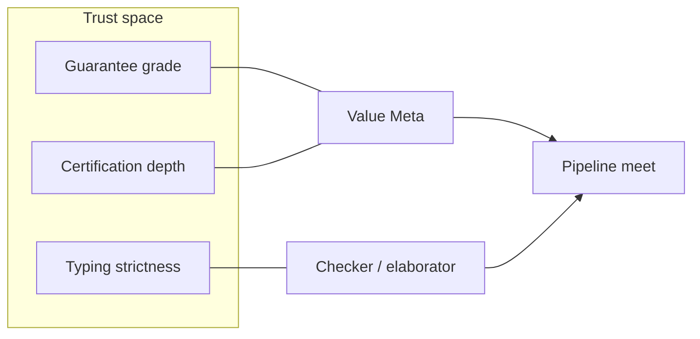

# Three orthogonal trust axes

Mycelium does not collapse "how sure are we?" into one dial. Three **independent**
axes build the language's trust space in real time — governance documents are
literally constructing that space, not filing paperwork.

| Axis | Question | Levels / modes | Primary docs |
|---|---|---|---|
| **1. Guarantee grade** | How strong is this *claim*? | Exact ⊐ Proven ⊐ Empirical ⊐ Declared | RFC-0001 · ADR-001 · VR-5 |
| **2. Certification depth** | How much *machinery* ran? | `fast` · `balanced` · `certified` | RFC-0034 · ADR-032 |
| **3. Typing strictness** | How hard does the *checker* refuse? | loose (interpret) · strict (compile gate) | DN-126 · M-1077 |

## Why three axes (not one)

- A `fast`-mode value can still be tagged `Exact` if its *basis* is exact (identity
  of empty meet) — mode says whether certificates were *emitted/checked*.
- A `certified` run can still produce `Empirical` if the op is resonator-class
  (FR-C2) — mode cannot invent a stronger basis.
- Loose typing (DN-126, Accepted/`Declared` until M-1077 lands) speeds iteration
  without relaxing what a `Proven` tag is allowed to mean.

**Thematic header for DN-126:** *the third orthogonal axis of trust* — place it
beside the lattice and cert modes, not as "yet another DN in the gap-close list."

## Developer mental model

1. **Write** under the strictness mode that matches the feedback loop you want.
2. **Tag** claims at the honest grade (never upgrade without basis).
3. **Ship** under the cert depth the consumer requires; airlock at boundaries
   ([02 — airlocks](02-guarantee-airlocks.md)).

## See also

- [05 — Thematic decision map](05-thematic-decision-map.md) (DN-126 cluster)
- [diagrams](diagrams.md#three-trust-axes)
