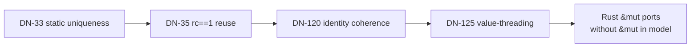

# Thematic decision map — achievements, not meeting minutes

> **Audio critique:** DN-119…140 as a flat sequence dilutes the victory of the
> ADR-045 gap-closure window. Group by *what problem cluster closes*. Numeric
> files remain the permanent record; this map is the historian's index.

**Status discipline:** check `docs/Doc-Index.md` before treating any row as Enacted.
Many DNs are **Accepted / Declared** until build issues land.

## Cluster A — Closing the mutation loop

| Docs | Completes | How they interlock |
|---|---|---|
| DN-33 / MEM-4 | Static uniqueness / RC elision | Proves when `Dup` can become `Borrow` |
| DN-35 | `rc == 1` in-place reuse | Physical reuse when no live alias of old identity |
| DN-120 | Identity ↔ reuse coherence | Residual closed *by design* (weak map / eviction) |
| DN-125 | Value-threading for `&mut` | `x.f()` → rebind `x = f(x)`; zero-copy when L1/L2 fire |

**Narrative:** decisions from the memory program **structurally enable** today's
transpile ergonomics. Not three unrelated numbers — one loop closed.

## Cluster B — Three axes of trust (dimension space)

| Docs | Completes |
|---|---|
| RFC-0001 / ADR-001 | Guarantee lattice (axis 1) |
| RFC-0034 / ADR-032 | Certification depth (axis 2) |
| DN-126 | Typing strictness (axis 3) — *thematic title, not a footnote* |

See [04 — Three trust axes](04-three-trust-axes.md).

## Cluster C — Native L3 expressibility (stdlib crutches dissolved)

These are **not** a list of trait paperwork. Together they remove Rust-shaped
crutches (`&mut Formatter`, derive-as-magic, missing prelude, etc.) in favor of
value-semantic natives under DN-110/111 taxonomy.

| Theme | Docs (non-exhaustive) | Native answer sketch |
|---|---|---|
| Formatting | DN-127 · M-1090 | `render: T → Bytes`; `write!`/`format!` → `bytes_concat` |
| Derive library | DN-128 · M-1086 | lower-rules, not kernel growth |
| Init / Fault | DN-129 · M-1091 | prelude traits via seed mechanism |
| Generics / bounds | DN-130 · DN-131 | parametric instances; bound redistribution |
| Patterns / calls | DN-132…135 | struct-variant, mangled assoc, combinators |
| Emit architecture | DN-136 | interfaces-first hook tables |
| Unit / derives seed | DN-137 · DN-138 | nullary ADT; prelude instances |
| Identifiers | DN-140 · M-1106 | total `valid_ident` + length-prefix mangler |

**Impact line for readers:** this cluster is the **ADR-045 architectural reveal** —
governance *compiled* a solution to "stdlib without `&mut` theater," incrementally.

## Cluster D — Physical / AOT leg of the data model

| Docs | Completes |
|---|---|
| RFC-0039 | Native Dense/VSA lowering; dynamic-VSA JIT as named `ExecMode` |
| ADR-030/031 | Quant granularity; VSA element-space / sparsity / complex carrier |
| DN-01 / RFC-0004 §5 | Packing is schedule, not type |

## Cluster E — Surface & safety scaffolding

| Docs | Completes |
|---|---|
| RFC-0037 | Bracket families, `=>`, layout independence (**Enacted**) |
| RFC-0040 | List literal → cons-shaped ADT |
| RFC-0041 | Recursion depth / work stacks (**Enacted**) |
| RFC-0036 | Frozen L0 kernel posture |

## Cluster F — Self-hosting program

| Docs | Completes |
|---|---|
| ADR-042/043 | Mycelium-first rewrite; archive-never-delete |
| ADR-045 | Bounded unfreeze for gap-close |
| M-991 / DN-34 | Transpile as gap profiler, not bulk porter |
| DN-119 | L3 = native answers to problems, not Rust syntax cloning |

## How to use this map

1. Pick the **problem** you care about (mutation, trust, format, AOT…).
2. Read the cluster **top-down** (interlock paragraph first).
3. Open the **numbered DN/RFC** only for the clause you need.
4. Confirm **status** in Doc-Index (Accepted ≠ built).

## See also

- [diagrams — decision clusters](diagrams.md#decision-clusters)
- External analysis tails: `_sources/08-document-tails-latest-decisions.md`
