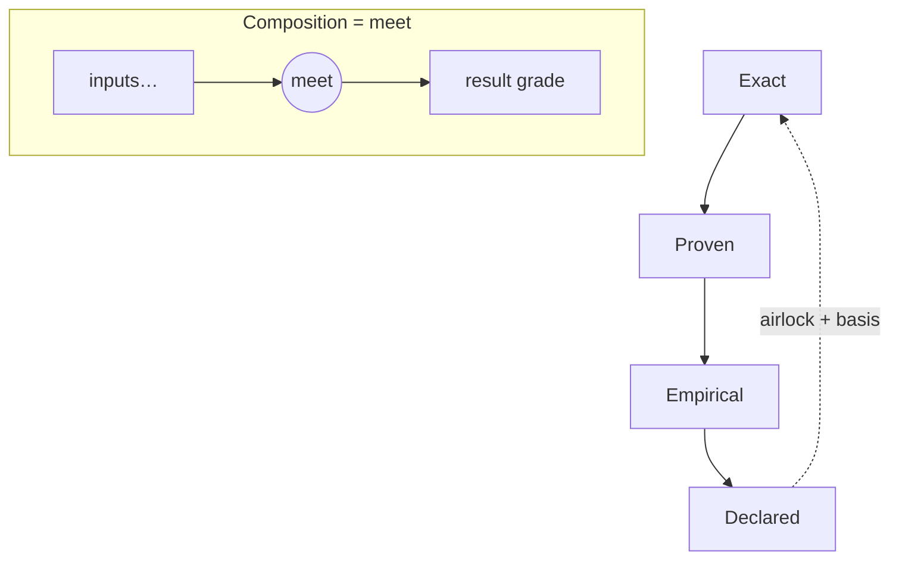
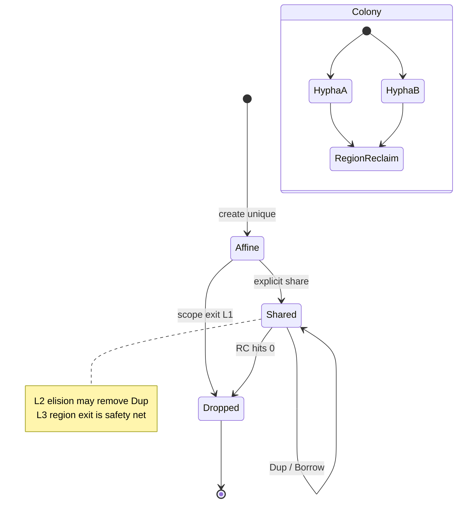
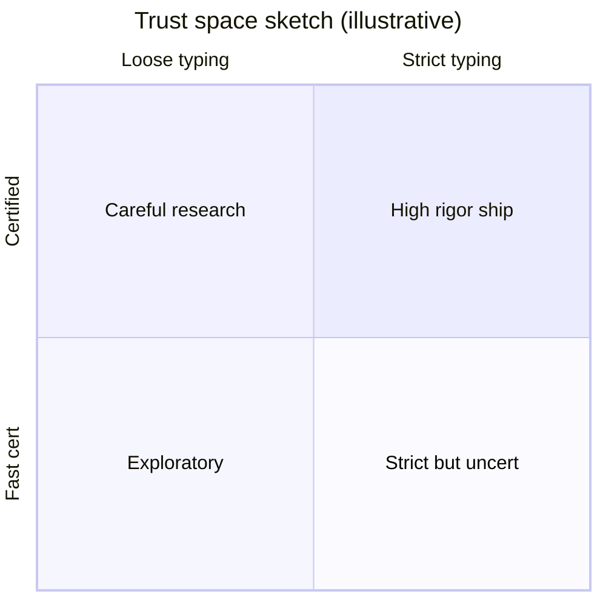
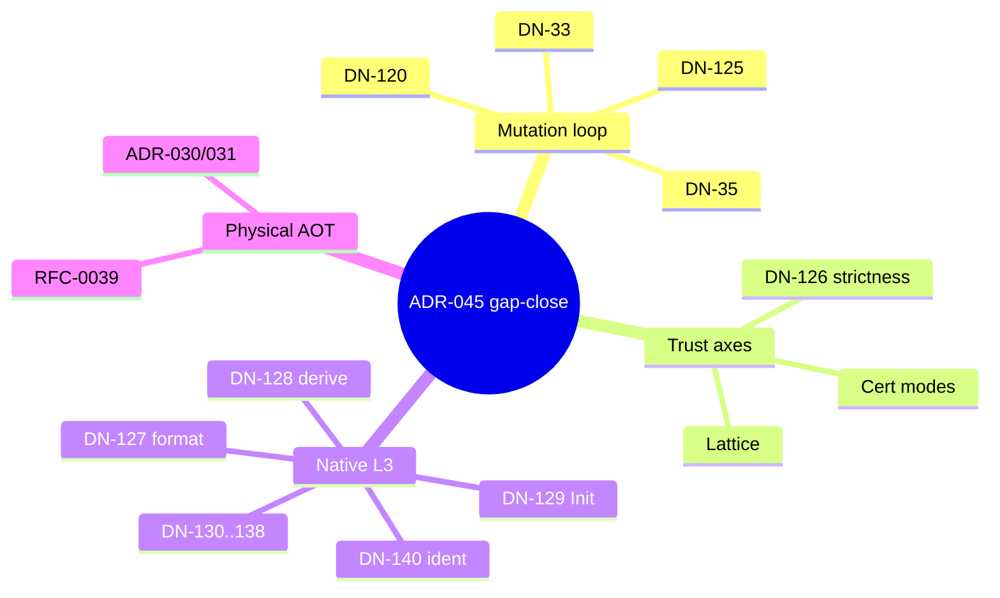
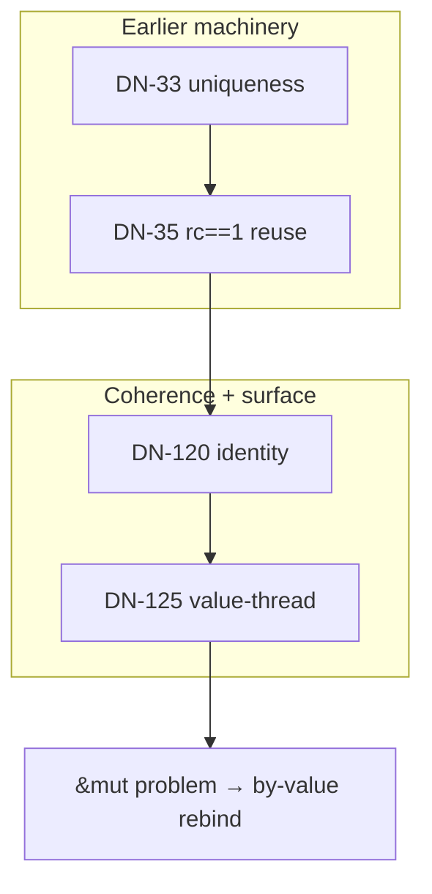
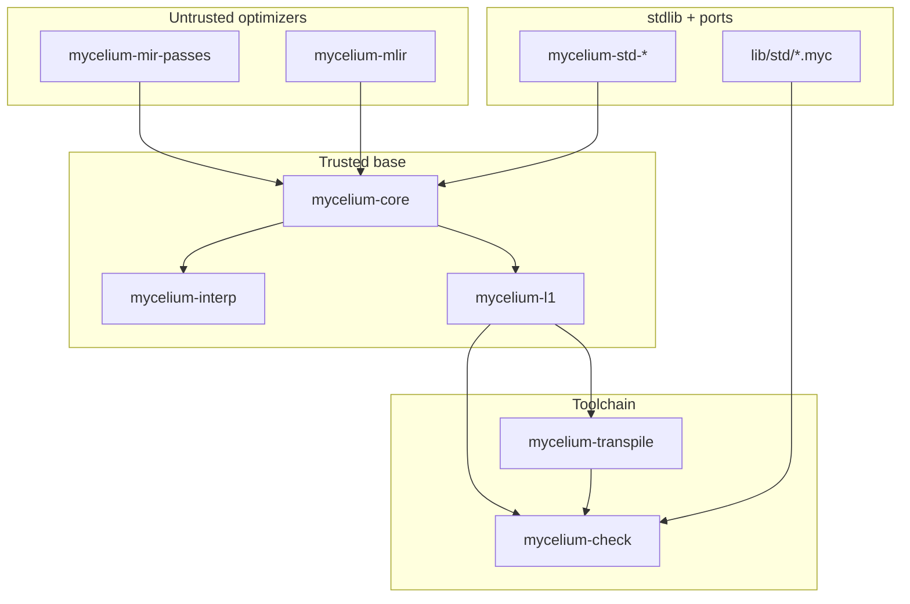
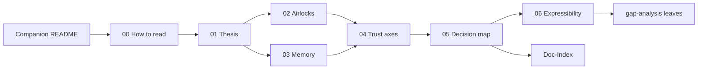

# Diagrams — flows, maps, relationships

All diagrams are **Mermaid** (GitHub / many docsites render natively). They are
curatorial; status edges must match Doc-Index when in doubt.

## Guarantee lattice

## Memory lifecycle

## Three trust axes

*(Quadrant chart is pedagogical only — real axes are three-dimensional; see
[04](04-three-trust-axes.md).)*

## Decision clusters (ADR-045 window)

## Mutation loop interlock

## Crate strata (sketch)

## Reading graph

