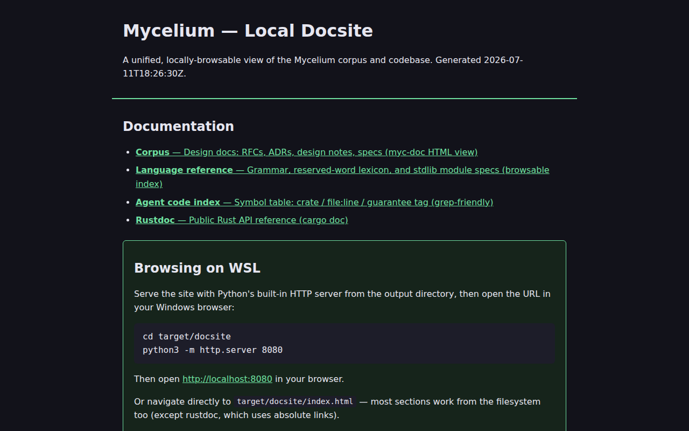
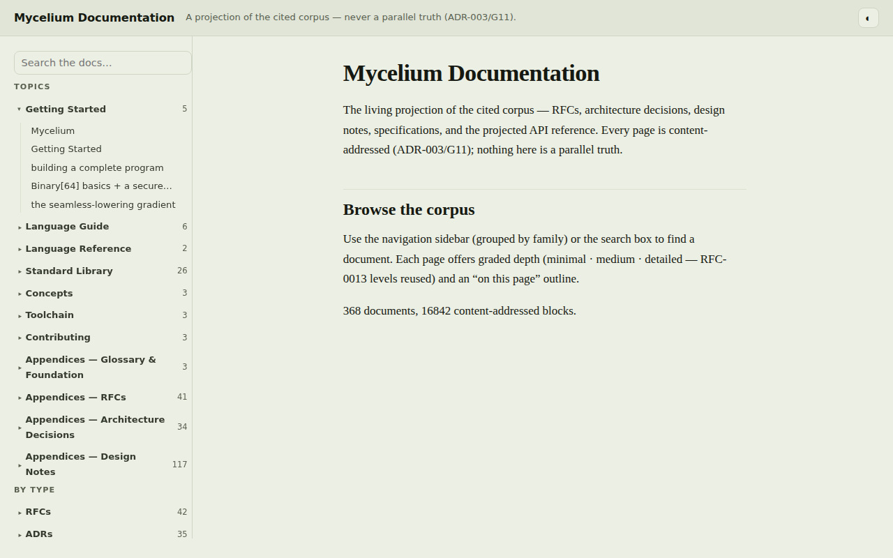
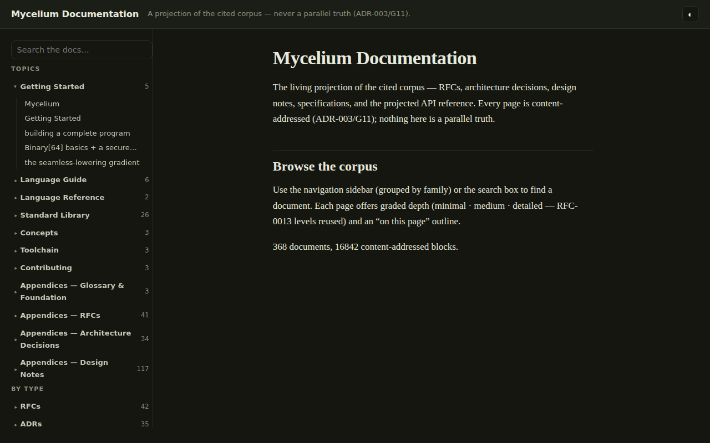
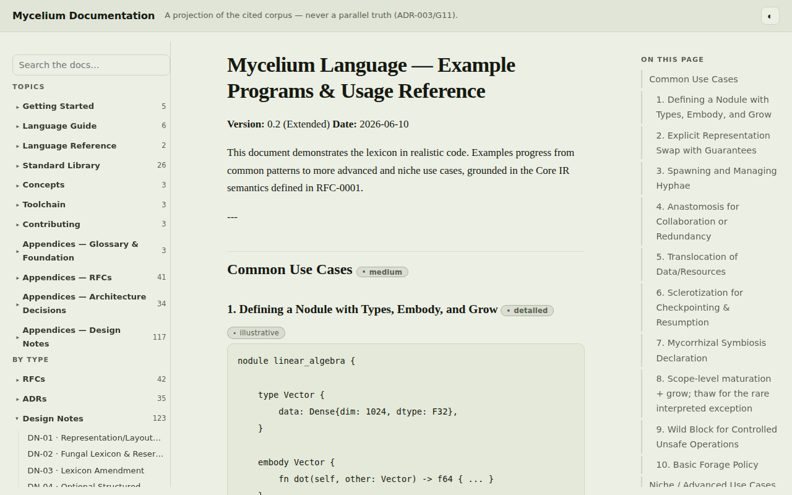
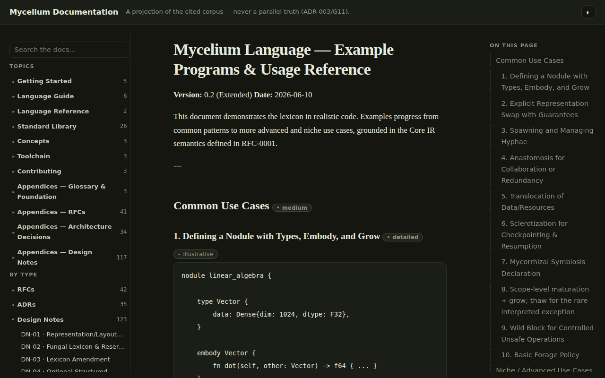
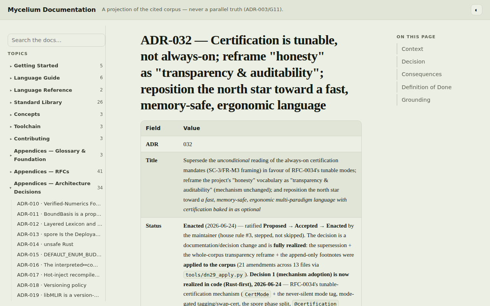
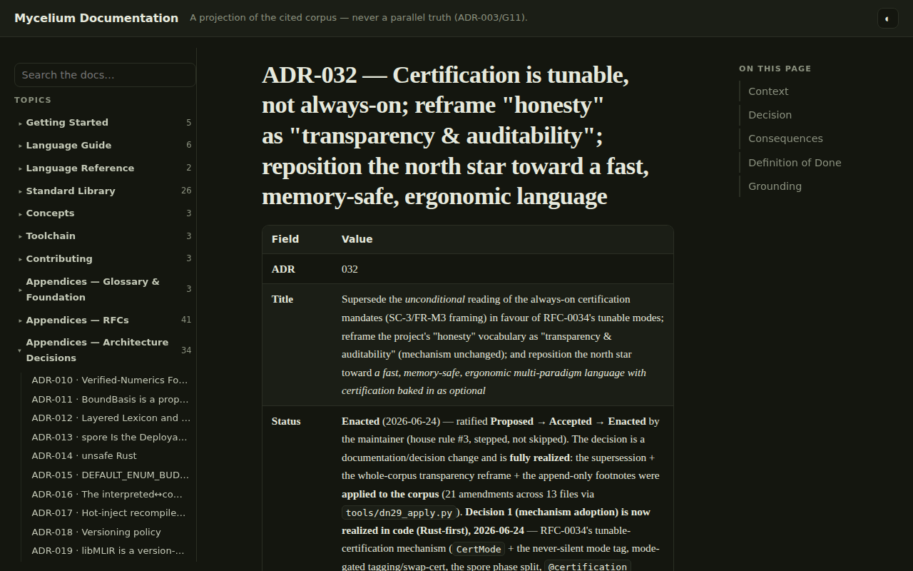

# Docsite preview (screenshots)

One-line purpose: a visual preview of the local, browsable docsite (`just docs-site`), so a reader
can see what it looks like before building it — and the canonical source for the images in
`docs/assets/`.

## Contents

- [What this is](#what-this-is)
- [Home page](#home-page)
- [Documentation nav / index](#documentation-nav--index)
- [A code-bearing page](#a-code-bearing-page)
- [A rendered decision doc](#a-rendered-decision-doc)
- [How these are regenerated](#how-these-are-regenerated)

## What this is

`just docs-site` (`scripts/docsite.sh`) assembles a single local, browsable site under
`target/docsite/` from three sources: the design corpus (RFCs/ADRs/DNs/specs, projected to HTML by
`myc-doc build`), the agent code index (`docs/api-index/`), and rustdoc. It is advisory tooling,
not a hosted product — this page exists so the shape of that output is visible from the repo
itself, without anyone having to build and serve it first.

**Honesty note (VR-5/G2 — these are Declared/Empirical projections, not a live product):** the
docsite ships a **real** light/dark theme — every page honours the reader's OS
`prefers-color-scheme` by default, and a persisted `data-theme` toggle (top-right of the corpus/book
header) overrides it in both directions. Two independent sources cooperate:
- The corpus/book pages (`crates/mycelium-doc/src/emit/html.rs`, `crates/mycelium-doc/src/book.rs`)
  share one stylesheet, [`crate::theme::READING_CSS`](../../crates/mycelium-doc/src/theme.rs) — the
  guarantee-lattice palette (`moss`/`amber`/`clay`/`ink-blue`) declared for both light and dark, with
  a `@media (prefers-color-scheme: dark)` default and `:root[data-theme="dark"|"light"]` overrides
  for the toggle. Asserted by a `cargo test -p mycelium-doc` case
  (`the_emitted_css_ships_a_real_prefers_color_scheme_dark_rule`).
- `scripts/docsite.sh`'s own hand-rolled pages (the landing `index.html`, the language-reference
  page, and the api-index HTML wrapper) are independent, non-Rust output with their own small
  `--fg`/`--bg`/`--accent`/`--dim`/`--code` custom-property set; they now carry their own real
  `@media (prefers-color-scheme: dark)` override (`DOCSITE_DARK_CSS` in `scripts/docsite.sh`, shared
  across all three so they agree) rather than theme.rs's palette (a different renderer, so a
  separate — but equally real — dark rule, not a second copy of the same one).

The `-dark` screenshots below are the site's genuine dark rendering: `scripts/docs-assets/capture.mjs`
just switches the browser's emulated `prefers-color-scheme` (`page.emulateMedia`) before capturing —
no capture-time stylesheet override is applied or needed anymore.

## Home page

| Light | Dark |
|---|---|
|  |  |

## Documentation nav / index

The corpus index page (`corpus/index.html`) — the `<nav>` tree a reader browses the RFC/ADR/DN/spec
corpus from.

| Light | Dark |
|---|---|
|  |  |

## A code-bearing page

`docs/notes/Example-Programs-Reference.md` as rendered — `.myc` code fences shown in their
projected `<pre><code class="language-mycelium">` form.

| Light | Dark |
|---|---|
|  |  |

## A rendered decision doc

`docs/adr/ADR-032-Tunable-Certification-Supersedes-Always-On-and-Transparency-Reframe.md` as
rendered — the decision this repo's transparency rule (CLAUDE.md house rule 1) traces to.

| Light | Dark |
|---|---|
|  |  |

## How these are regenerated

`just docs-assets` (`scripts/docs-assets.sh`) runs the whole capture → optimize → replace-in-place
→ prune workflow: builds `target/docsite/`, serves it locally, captures the set above via
Playwright (`scripts/docs-assets/capture.mjs`) in both themes, optimizes the PNGs with `oxipng` or
`pngquant` when either is installed (skip-graceful otherwise), and deletes any `docs/assets/*` file
no longer referenced by a committed doc. Filenames are **stable and descriptive, never
content-hashed** — a re-run overwrites the same files in place, so the working tree never
accumulates duplicates. `scripts/checks/docs-assets.sh` (wired into `just check`) is the
lightweight, browser-free companion gate: it fails if a doc references a `docs/assets/` file that
doesn't exist, or if `docs/assets/` holds a file no committed doc references — the same
referenced-but-missing / present-but-orphaned drift check the `docs/api-index/` and
`docs/tero-index/` gates run for their own committed-generated artifacts.

## Changelog

- 2026-07-11 — Added (docs asset automation: `just docs-assets` + `scripts/checks/docs-assets.sh`).
- 2026-07-11 — Real light/dark theme wired site-wide (`prefers-color-scheme` + `data-theme` toggle
  in `crates/mycelium-doc/src/theme.rs`/`html.rs`/`book.rs`; a matching `DOCSITE_DARK_CSS` for
  `scripts/docsite.sh`'s own pages); the `-dark` screenshots are now genuine renders, not a
  capture-time override — the prior disclaimer no longer applies.
