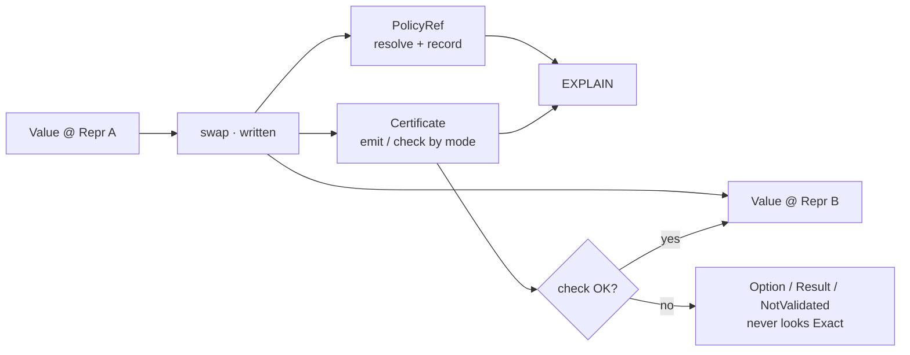
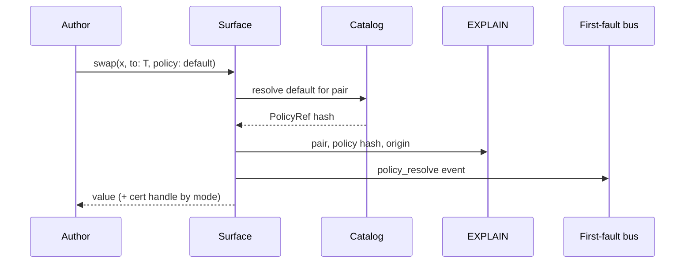

# Design pack 01 — Swaps & policy ergonomics

| Field | Value |
|---|---|
| **Status** | **Draft** design package — not Accepted · not implement |
| **Pack** | 1 of 3 · with [02 Tags & containment](./DESIGN-02-TAGS-META-AND-CONTAINMENT.md) · [03 Machinery, diagnostics & UX](./DESIGN-03-MACHINERY-DIAGNOSTICS-AND-UX.md) |
| **Honesty** | Design positions `Declared` until ratified |
| **Sources distilled** | Agent A · council · `stdlib/swap.md` Q2 · RFC-0001/0002 · DN-29 · Agent F sites |
| **Primary package** | **Policy create + apply streamline** (catalog · default · resolve-and-record · EXPLAIN) — maintainer-elevated, not a buried sub-bullet |

## 1. Why this document exists

Mycelium’s signature operation is the **never-silent `swap`**: every representation change is
lexical, certified, and auditable. That power currently costs **call-site ceremony** (policy
threading, cert packaging, fallibility under-typed) and can make **failures hard to localize**.

This pack answers: *how do we keep S1/G2 honesty while making swaps usable every day?* The
**first answer is policy streamline** — create once (catalog), apply cheaply (default resolve),
always record identity (EXPLAIN + first-fault emitters).

## 2. Mental model

| Piece | Role | Must stay explicit? |
|---|---|---|
| **`swap` keyword / `std.swap.*`** | Marks Repr change | **Yes forever** (S1) |
| **`to:` target** | Destination Repr | Prefer written; optional elision only if unique expected type |
| **`policy:`** | Selection rule identity | **Yes as identity** — may elide *spelling* if resolved hash is recorded |
| **Certificate** | Audit of the change | Mode-gated emit/check; must remain **queryable** on failure |
| **Result shape** | Total vs partial | Typed by **regime** — do not type partial as total |

## 3. Pain (author-facing)

| ID | Pain | Wanted outcome |
|---|---|---|
| **P1** | Every site needs verbose `to:` + `policy:` | Short path for common pairs; still EXPLAIN-able |
| **P2** | `Swapped { value, cert }` forces threading | Value-forward default; cert still inspectable |
| **P3** | Policy authoring is a second subsystem | **Catalog** of content-addressed policies |
| **P4** | Legal pairs known late / at runtime | Static matrix where possible |
| **P5** | Tutorial types total when pair is partial | Regime → `Option`/`Result` |
| **P6** | Failed check / dig for “which swap?” | First-fault diagnostic (see pack 03) |
| **P7** | `fast` drops cert check but not syntax tax | Modes gate *machinery*, not honesty of writing swap |

**Hard rejects:** auto-insert `swap`; omit policy with **no** recorded identity; treat `NotValidated` as success.

## 4. Recommended package (Draft)

### 4.1 Policy streamline (★ primary package — maintainer priority)

**Product story:** authors **create** standard and custom policies once, **apply** them at every
site with minimal tax, and always **see** which policy ran (hash · catalog id · pair) without
path folklore. A resolve that cannot be EXPLAINed is not streamlined.

| Step | Mechanism | Effect | First-fault site (pack 03) |
|---|---|---|---|
| **A1** | **Legal-pair matrix** in checker (RFC-0002 data) | Early refuse illegal pairs | `legal_pair_refuse` |
| **A2** | **`std.swap.policy` catalog** — content-addressed defaults + same shape for custom | **Create** path; pick by name/intent | (catalog id in resolve) |
| **A3** | **`policy: default` (or `_`)** → resolve → **record** `PolicyRef` + EXPLAIN origin | **Apply** ergonomics without black box | `policy_resolve` |
| **A4** | Optional nodule/phylum **ambient policy** for *written* swaps only | Same pattern as ambient paradigm (RFC-0012) | `policy_resolve` (origin=ambient) |

**Rules:**

1. Elision is *spelling* only — L0 always stores resolved `PolicyRef` (**resolve-and-record**).
2. If resolution fails → **hard error**, never silent fallback policy.
3. Custom policies use the **same** content-addressed shape as catalog entries (no third system).
4. EXPLAIN + first-fault emitters are **DoD for A3**, not a follow-on nice-to-have.

### 4.2 Typing & cert packaging

| Step | Mechanism | Effect | First-fault site |
|---|---|---|---|
| **A5** | **Regime → result type** (total / Option / Result) | Honest fallibility | `regime_type_lie` on total-over-partial |
| **A6** | **Cert ambient** (value-forward; cert queryable) *or* keep explicit `Swapped` until failure is always materializable | Cuts P2 without hiding fail | `swap_check` on refuse |
| **A7** | Named std ops desugar to keyword `swap` | One type story | same EXPLAIN shape |

**Joint gate with packs 02/03:** if cert is ambient, **failed check must still surface** as typed
failure + first-fault event — never Exact success.

### 4.3 Localize swap failures (part of package DoD)

Attachment points for diagnostics (schema in pack 03 §3). Each refuse emits a
**first-fault** record with source span + why — authors must not dig the tree for “which swap?”.

| site_kind | Trigger |
|---|---|
| `policy_resolve` | Catalog / default / ambient → `PolicyRef` |
| `legal_pair_refuse` | Illegal pair / no statable bound |
| `swap_exec` | Runtime Ok/Err / out-of-range |
| `swap_check` | Cert Validated / Refuted / NotValidated |
| `regime_type_lie` | Checker: total type over partial regime |
| `missing_conversion` | Cross-paradigm without written `swap` |

Deep site catalog + envelope: [DESIGN-03 §3](./DESIGN-03-MACHINERY-DIAGNOSTICS-AND-UX.md).

## 5. Ranked options (summary)

| Rank | Option | Verdict |
|---:|---|---|
| **1** | Catalog + default policy + legal matrix + regime types | **Recommend** |
| **2** | Cert ambient after failure materializability lands | Follow-on |
| **3** | `to:` elision + named-op sugar | Follow-on |
| **4** | Tooling candidates only (LSP insert-swap) | Parallel, never auto-apply |
| **REJECT** | Auto-swap · policy-less form · greenwash metrics | Disqualified |

## 6. Open questions for you

1. Spelling: `policy: default` vs `_` vs catalog name only?
2. Cert ambient as default authoring model, or keep explicit `Swapped` until the diagnostic bus lands?
3. Allow `to:` elision under unique expected type?
4. Vehicle: extend M-540 vs dedicated Swap Ergonomics DN after steer?

## 7. DoD before implement waves

- [ ] Maintainer steers §6
- [ ] Normative capture (DN/RFC amend) for A1–A3 (**policy streamline**)
- [ ] Conformance: expand(`policy: default`) ≡ longhand with same hash
- [ ] Fail paths never type as Exact under certified mode
- [ ] First-fault emitters on policy resolve + swap check (§4.3) — localize without tree dig

## 8. See also

- Pack [02](./DESIGN-02-TAGS-META-AND-CONTAINMENT.md) — grades, meet, seals
- Pack [03](./DESIGN-03-MACHINERY-DIAGNOSTICS-AND-UX.md) — AX ranks, emitters, UX backlog
- Annex [DESIGN-03 §3](./DESIGN-03-MACHINERY-DIAGNOSTICS-AND-UX.md) — full first-fault site catalog

## Changelog (this pack)

| When | Note |
|---|---|
| 2026-07-17 | Distill from Agent A into three-doc pack |
| 2026-07-17 | Integrate: policy streamline elevated as ★ primary; resolve-and-record DoD; A-emit site table; |
