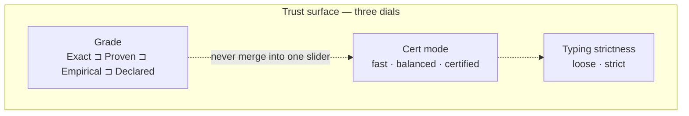
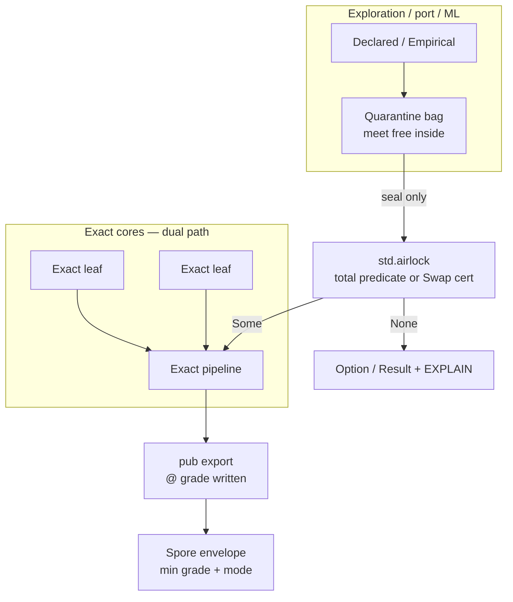
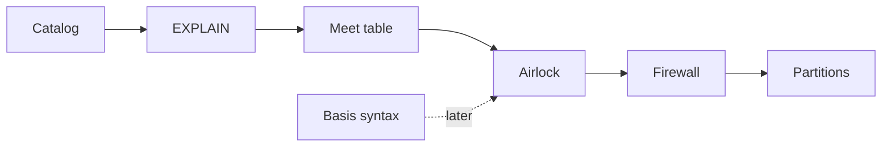

# Design pack 02 — Tags, Meta & honesty-poison containment

| Field | Value |
|---|---|
| **Status** | **Draft** design package — not Accepted · not implement |
| **Pack** | 2 of 4 · with [01 Swaps & policy](./DESIGN-01-SWAPS-AND-POLICY.md) · [03 Machinery, diagnostics & UX](./DESIGN-03-MACHINERY-DIAGNOSTICS-AND-UX.md) |
| **Honesty** | Design positions `Declared` until ratified |
| **Sources distilled** | Former Draft DN-141 · Agent D · companion 02/04 · RFC-0018 · RFC-0034 · ADR-032 · Agent F envelope |
| **Status discipline** | Remains **Draft** (DN-141 body successor in this pack — **not** Accepted) |

> Content integrates former Draft DN-141 and Agent D. Ratify later as DN-141 rewrite / DN-142 or
> RFCs as steered. Isolation EXPLAIN packages are **first-fault emitter instances** (pack 03 bus /
>  — not a parallel diagnostics invent.

## 1. Why this document exists

Composition uses lattice **meet** (weakest-wins). That is *correct integrity* — and also how one
`Declared` leaf, mixed dataset row, or `fast`-floored claim can **poison** an entire pipeline if
there are no **named boundaries**.

This pack answers: *how do tags stay honest without drowning authors, and how does contamination
stop at walls without killing Exact cores or greenwashing weak data?*

## 2. Three orthogonal axes (do not collapse)

| Axis | Answers | Silent collapse risk |
|---|---|---|
| **Grade** | How strong is this claim? | Treating `fast` as “all Declared forever” |
| **Cert mode** | How much cert machinery ran? | Treating unchecked certs as `certified` |
| **Typing** | How hard does the checker refuse? | Hiding refuse as warning-only without mode |

## 3. Mental model — plant vs cleanroom

**Invariant:** meet may **weaken** inside a bag. Crossing into Exact cores or certified consumers
requires a **seal** (or explicit weak export). Never `as Exact`.

## 4. Pain

| ID | Pain | Containment angle |
|---|---|---|
| **T1** | One weak intermediate degrades whole expression | Dual-path / meet-boundary |
| **T2** | Dataset `meet_all` zeros batch Exact | Partition by grade |
| **T3** | Unannotated fns forever Declared on return | Catalog inference; write `@ g` on **exports** |
| **T4** | `fast` meets into certified Exact | Mode firewall + seal |
| **T5** | VSA/resonator dust | Seal-to-codebook / ≤ Empirical explicit |
| **T6** | Transpile Declared flood | Draft-phylum quarantine; no tag fabrication |
| **T7** | Laundry seal (fake remint) | Checker remint hinge or no remint sugar |
| **U1** | Manual `@ g` ceremony everywhere | Modular bottom = Declared; write only to strengthen / export |
| **U2** | “Why Declared?” second-class | Grade EXPLAIN tiers |

## 5. Deterministic rules (preferred)

| Rule | Deterministic behavior |
|---|---|
| **R1 Modular bottom** | Unannotated code demands/advertises **Declared** |
| **R2 Weaken-only annotation** | `e @ g` may only weaken inferred grade |
| **R3 Matrix mint** | Library ops get grades from committed tables |
| **R4 Meet free inside nodule bag** | Composition inside quarantine OK |
| **R5 Meet refuse at export / Exact demand / certified consumer** without seal | Table-driven allow/refuse |
| **R6 Remint only if** total Exact-decidable predicate **or** Swap cert **or** basis-carrying strengthen | Else type error |
| **R7 Mode floor** | `fast` cannot display unearned Emp/Proven as checked |
| **R8 Isolation EXPLAIN** | Every dynamic boundary decision generates a package that is an instance of the pack 03 **first-fault envelope** (not a second bus) |

When pure dual-path is impossible (e.g. statistical models): consumer must **accept** weak grade **and**
receive EXPLAIN; if consumer demands `@ Exact` → **error**, not theater.

### 5.1 Isolation EXPLAIN package (minimum) — first-fault instance

When isolation is dynamic, generate:

| Field | Meaning |
|---|---|
| `boundary_kind` | `airlock` · `firewall` · `quarantine` · `meet_refuse` · `swap_check` |
| `input_grade` / `demand_grade` | lattice points at the boundary |
| `decision` | `pass_remint` · `pass_weak` · `refuse` · `fallback` |
| `basis_ref` | predicate id, Swap cert hash, trial method, or empty on refuse |
| `policy_used` / `cert_mode` | Meta fields |
| `where` / `event_id` | span + stable fault id (pack 03 envelope) |
| `never_silent` | always true for refuse/fallback |

Symptoms downstream set `parent_event` / `child_cause` to this first refuse. Consumption tiers:
lean · normal · audit (gen≠consumption; RFC-0034 §7).

### 5.2 Diagnostic surfaces for grade · meet · seal

Authors/tools answer **where / how / why** without reading the whole program. Map to pack 03
`site_kind` (payloads stay lattice-native):

| Surface | When it fires | site_kind | Instant localization |
|---|---|---|---|
| **Grade provenance** | EXPLAIN / hover “why this grade?” | grade provenance (not always refuse) | meet tree root + first weak leaf |
| **Meet decide** | Meet of two+ grades | `grade_meet` · `meet_boundary` | operands; rule id; allow/refuse |
| **Boundary refuse** | Export / certified demand / Exact partition | `meet_boundary` | demand vs input |
| **Seal attempt** | Airlock remint pass/fail | `seal_remint` | predicate; remint grade; empty basis on laundry refuse |
| **Annotation error** | Illegal strengthen / cast-upgrade | `grade_annotation` | written token; required Swap/seal/basis |
| **Mode × grade firewall** | Certified demand over fast-floored claim | `mode_firewall` | mode cell + grades (not a grade rewrite) |

**Generation ≠ consumption:** lean stubs on refuse/downgrade; audit DAGs pull/opt-in. Do not emit
on every successful Exact structural op in `fast`.

## 6. Recommended package (Draft)

| Slice | What | Role |
|---|---|---|
| **B1** | Structural **grade catalog** + CI overclaim guard | Everyday honesty without hand tags |
| **B2** | Grade / isolation **EXPLAIN** lean · normal · audit | “Why this grade / boundary?” |
| **B3** | **Meet-boundary table** (export / certified / Exact partition) | Deterministic walls |
| **B4** | **`std.airlock`** seal/recertify + laundry CI | Named remint only |
| **B5** | **Certified firewall** (mode × grade) | Cross-mode refuse without seal |
| **B6** | Spore / dataset **partitions** | Packaging-level containment |
| **B7** | Optional basis syntax `@ Empirical(…)` / `@ Proven(…)` | When dogfood needs WRITE+EARN |

**Author ceremony budget:** zero tags on exploratory code; annotate **public APIs** and **seals**;
Exact cores stay on dual-path inputs.

## 7. Hard rejects

- Ambient nodule `@ Exact` upgrade
- Join/optimistic composition that hides weak inputs
- Cast-to-stronger
- Global Declared floor “to be safe” (quality kill)
- Selling DX as a substitute for real remint

## 8. Open questions for you

1. Remint: allow Empirical only with trial basis, or Exact-predicate only first?
2. `Quarantined[T]` type carrier now, or export-only seal first (YAGNI)?
3. Certified colonies: allow `fast` spores only via explicit airlock?
4. Meet free inside whole phylum, or only inside nodule?
5. Promote as DN-141 rewrite vs new DN-142 “containment topology”?

## 9. DoD before implement waves

- [ ] Steers on §8
- [ ] Remint hinge specified so laundry is impossible by construction
- [ ] Stress probes in pack 03 pass
- [ ] No status claim Accepted until ratification

## 10. See also

- Pack [01](./DESIGN-01-SWAPS-AND-POLICY.md) — Swap cert failures feed the same isolation story
- Pack [03](./DESIGN-03-MACHINERY-DIAGNOSTICS-AND-UX.md) — first-fault emitters, full AX rank, UX backlog
- Annex [DESIGN-03 §3](./DESIGN-03-MACHINERY-DIAGNOSTICS-AND-UX.md) — shared envelope + site catalog

## Changelog (this pack)

| When | Note |
|---|---|
| 2026-07-17 | Distill former DN-141 Draft + Agent D into pack 02 |
| 2026-07-17 | Integrate: isolation EXPLAIN = first-fault instance; §5.1–§5.2 grade/meet/seal diagnostic surfaces; Draft discipline restated |

- Pack [04](./DESIGN-04-LEDGER-RETENTION-AND-OFFLOAD.md) — language/runtime internal ledger retention (not app logs)
