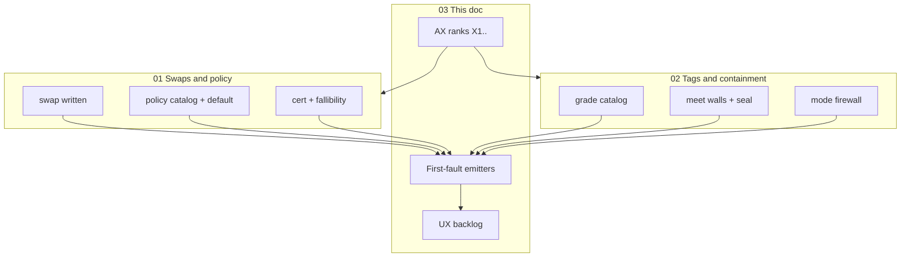
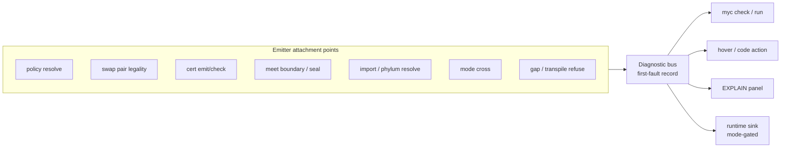
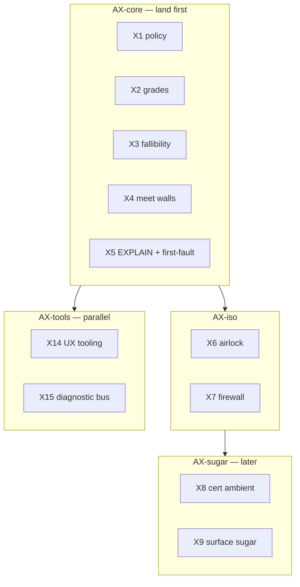

# Design pack 03 — Machinery, diagnostics & broader UX

| Field | Value |
|---|---|
| **Status** | **Draft** design package — not Accepted · not implement |
| **Pack** | 3 of 4 · with [01](./DESIGN-01-SWAPS-AND-POLICY.md) · [02](./DESIGN-02-TAGS-META-AND-CONTAINMENT.md) · [04 language-internal retention](./DESIGN-04-LEDGER-RETENTION-AND-OFFLOAD.md) |
| **Honesty** | Design positions `Declared` until ratified |
| **Sources distilled** | Agent C · E · F · RFC-0005 · RFC-0013 · DN-04 · RFC-0034 §7 · packs 01–02 |

## 1. Why this document exists

Packs 01–02 define *what* must stay honest. This pack defines *how the system helps you
**operate** it*: unified **machinery ranks**, **instant localization** of failures (compile +
runtime), and a **broader UX/DX backlog** that does not invent auto-swaps or greenwash.

**Core UX/DX claim (maintainer):** failures that force “dig the whole tree” kill the project
even when they are never-silent. Digging is a defect class of its own (**N9 / first-fault
localization** — non-negotiable alongside never-silent).

## 2. Package map (how the three docs fit)

## 3. First-fault diagnostics & trace emitters

### 3.1 Problem

Mycelium already refuses silently (G2). The remaining pain is **localization cost**:

| Phase | “Insane dig” examples |
|---|---|
| **Compile / check** | Import chains, meet contamination root, missing swap site, gap class soup, mode vs grade confusion |
| **Transpile / vet** | File-level poison with first diagnostic buried; dual-report misunderstood |
| **Runtime** | Which swap/policy/seal failed? Which meet boundary? Which mode floor applied? |

### 3.2 Design goal

At **key junctions**, emit a **structured first-fault event** so the answer to *where / how / why*
is **one hop** — not a full-tree archaeology expedition.

### 3.3 First-fault record (minimum schema)

| Field | Purpose |
|---|---|
| `event_id` | Stable id for this fault instance |
| `phase` | `compile` · `check` · `runtime` · `transpile` · `packaging` |
| `site` / `where` | Source span / IR node / spore id / hypha id |
| `site_kind` / `kind` | See §3.3a catalog |
| `decision` | refuse · seal_fail · not_validated · resolved · fallback · remint · candidate · … |
| `how` | registry machine code (RFC-0013 / DN-22 projection) |
| `why` / `message` | structured reason + human one-liner |
| `grades` | input grades + result grade (if any) |
| `policy_ref` | hash if selection involved |
| `cert_mode` | active mode |
| `basis_ref` | matrix row / predicate id / cert hash, or empty |
| `parent_event` / `child_cause` | first-fault link (symptoms cite cause; not full tree by default) |

**Rules:**

1. **First-fault wins** for the default UX — optional “expand children” for audit.
2. **Generation ≥ middle tier always** (RFC-0034): signal exists even in `fast`.
3. **Consumption** is dialable (lean CLI vs audit) — **gen ≠ consumption** (no perf death from noise).
4. Never invent success; never upgrade grades in the diagnostic itself.
5. Diagnostics are **additive** over explicit `Result`/`Option`/type errors (DN-04 / RFC-0013) —
   never substitute logs for fallibility.
6. **No third swap-policy system** — policy identity comes only from pack 01 catalog + resolve.

### 3.3a Site catalog (must-emit junctions)

| site_kind | Phase | Trigger | Pack home |
|---|---|---|---|
| `policy_resolve` | check | Catalog / `policy: default` / ambient → `PolicyRef` | 01 |
| `legal_pair_refuse` | check | Illegal Repr pair | 01 |
| `missing_conversion` | check | Cross-paradigm without `swap` | 01 |
| `regime_type_lie` | check | Total type over partial regime | 01 |
| `swap_exec` | runtime | Swap Ok/Err / out-of-range | 01 |
| `swap_check` | runtime | Cert Validated / Refuted / NotValidated | 01 · 02 |
| `meet_boundary` | check/runtime | Export / certified demand / Exact partition | 02 |
| `grade_meet` | runtime | Dynamic meet of tagged values | 02 |
| `seal_remint` | runtime | Airlock pass/fail | 02 |
| `mode_firewall` | check | Mode × grade refuse without seal | 02 |
| `grade_annotation` | check | Illegal strengthen | 02 |
| `import_first_edge` | check | First bad import edge | 03 |
| `transpile_gap` | transpile | First poison / residual | 03 |

**Non-sites:** every arithmetic/field access; pure Exact success in `fast` (optional crumb only);
intermediate meets inside an already-quarantined bag (package at export).

Isolation EXPLAIN fields (pack 02) are a **field-set** of this envelope for isolation
`site_kind`s — one bus, many sites. Site catalog above is the complete Localize-1 attachment list
(no separate annex file).

### 3.4 Compile-time vs runtime

| Layer | Emitter form | Instant zero-in |
|---|---|---|
| **Checker / `myc check`** | Primary diagnostic + related span + first-fault id | Jump to written `swap` / missing seal / import home |
| **Transpile vet** | Per-file first poison + class + `// src:` breadcrumb | Closest-to-clean ordering |
| **Runtime** | Event on refuse / NotValidated / seal fail / mode cross | Span + policy hash + mode in one record |
| **LSP** | Hover shows EXPLAIN + first-fault; code actions = **candidates only** | No auto-insert swap/seal |

### 3.5 Consumption tiers (gen ≠ consumption)

| Tier | Shows | Default when |
|---|---|---|
| **lean** | site_kind · where · decision · code | `fast` CLI |
| **normal** | + why · key inputs · basis_ref short | refuse paths; interactive |
| **audit** | full envelope + meet DAG / cert / policy expand | certified / `myc explain` |

### 3.6 Ranked options for the bus

| Rank | Option | Notes |
|---:|---|---|
| **★ 1 Localize-1** | Shared first-fault schema + site catalog §3.3a + tiered EXPLAIN | **Recommend** |
| **2** | Unify under existing EXPLAIN product (RFC-0005) with severity channel | Prefer extend over new kernel (still Localize-1 schema) |
| **3** | Domain silo enrichment only (GapReason strings) | Interim; absorb into Localize-1 |
| **4** | Rich distributed tracing (OpenTelemetry-shaped) | Later; must map to first-fault |
| **REJECT** | Always-on full spans as default · log spam without structure · hide Declared · auto-fix by inserting swaps | |

## 4. Unified AX ranks (land order)

Ship as **one story**, review as **independent slices**. Tables before sugar; walls before elision.

| Rank | Slice | Pack home |
|---:|---|---|
| **X1** | Legal-pair matrix + policy catalog + `policy: default` | 01 |
| **X2** | Structural grade catalog + three-axis EXPLAIN | 02 · 03 |
| **X3** | Regime → Option/Result for swaps | 01 |
| **X4** | Meet-boundary / export quarantine table | 02 |
| **X5** | Isolation + first-fault EXPLAIN package (shared schema) | 02 · 03 |
| **X6** | `std.airlock` + remint hinge | 02 |
| **X7** | Certified mode×grade firewall | 02 |
| **X8** | Cert ambient (only if failure still materializes) | 01 |
| **X9** | Optional sugar (`to:` elision, named ops) | 01 |
| **X10** | Basis-carrying `@ Empirical/@ Proven` | 02 |
| **X11** | LSP/transpile **candidates** only | 03 |
| **X12** | Spore/dataset partitions | 02 |
| **X13** | Lint profiles (pub grade, laundry) | 02 · 03 |
| **X14** | Broader UX presentation tooling | 03 |
| **X15** | First-fault diagnostic bus (this pack §3) | 03 |

### Package bundles

| Bundle | Contents | Intent |
|---|---|---|
| **AX-core** | X1–X5 + X15 | Usable honesty + localizable failures (policy streamline + first-fault) |
| **AX-iso** | X6–X7 | Containment surface |
| **AX-sugar** | X8–X10 | Ceremony cut after gates |
| **AX-tools** | X11–X14 | Parallel presentation; **consumes** X15 bus |

**X1 naming:** treat as **policy streamline** (catalog · create · apply · resolve-and-record ·
EXPLAIN) — not “legal matrix only.” **X15** is the diagnostic bus; isolation EXPLAIN (X5) and
policy resolve share its envelope.

## 5. Broader UX/DX backlog (beyond swaps/tags)

Prefer **tooling presentation of existing truth** before new language forms.

### 5.1 Rank-1 diagnostics spine (fold Agent F into presentation)

Agent E Rank-1 tooling **consumes** the X15 / Localize-1 bus — it does not invent a parallel
schema. Ship presentation over the envelope:

| Pri | Item | Kind | Bus role |
|---|---|---|---|
| **P0** | Transpile worklist: `// src:` breadcrumbs, closest-to-clean, first poison | tooling | emits/consumes `transpile_gap` |
| **P0** | Phylum dual-report as default vet story | measurement UX | honest refuse class |
| **P0** | Always print active `CertMode` on check/run | CLI | mode field always present |
| **P0** | Three-axis labels (grade · mode · typing) everywhere diagnostics appear | presentation | prevents axis collapse |
| **P0** | Lean first-fault one-liner on every refuse (where · site_kind · decision) | CLI/LSP | **primary N9 surface** |
| **P1** | Unified EXPLAIN panel (lean/normal/audit over envelope) | tooling | hosts isolation + policy + grade |
| **P1** | `reveal` / expand ambient+policy+mode | sugar transparency | expand, never invent |
| **P1** | Result/Option match ergonomics (DN-135 track) | language | fewer false digs in ports |
| **P1** | Thin `myc` facade over existing bins (`explain`, `check`) | CLI | one door to first-fault |
| **P2** | Progressive path: tutorial → companion → certified cores | docs | teach walls + emitters |
| **P2** | Lexicon “card” for hypha/colony/swap/Meta | docs | |
| **P3** | Full type-aware LSP beyond candidates | tooling | |

**Refuse:** auto-insert swaps; ambient Exact; hide Declared; one “trust” slider; pretty reports
that invent Proven metrics.

## 6. Shared non-negotiables (pack-wide)

| # | Gate |
|---|---|
| N1 | Never-silent (G2) |
| N2 | No guarantee upgrade without basis (VR-5) |
| N3 | No silent / auto `swap` (S1) |
| N4 | Policy identity recorded when selection runs (streamline ≠ omit) |
| N5 | Contamination stops at walls — no laundry, no quality kill |
| N6 / **N9** | **First-fault localization** for hard junctions — where/how/why without tree dig |
| N7 | Gen ≥ middle; consumption dialable (no ambient audit flood) |
| N8 | Deterministic tables before sugar |

## 7. Contamination & diagnostics stress probes

1. One `Declared` leaf: wall + EXPLAIN, or whole-pipeline poison?
2. Failed swap check: can it look Exact under certified? (**no**)
3. Laundry seal without predicate? (**no**)
4. “Safe” mode kills all Exact cores? (**no**)
5. Mixed-grade dataset ships as one silent floor? (**no**)
6. Runtime refuse without first-fault record? (**no**)
7. Transpile invents Proven to raise metrics? (**no**)
8. Digging required to find the written `swap` site? (**no** — span in first-fault)

## 8. Steering board (consolidated)

Answer these to unlock re-rank + implement resume:

### Swaps & policy (01)

1. `policy: default` spelling?
2. Cert ambient vs explicit `Swapped` until bus lands?
3. `to:` elision allowed?

### Tags & containment (02)

1. Remint hinge scope (Exact-only first?)
2. Meet free inside nodule only vs phylum?
3. DN number for ratification (141 rewrite vs 142)?

### Diagnostics & UX (03)

1. First-fault bus as extension of EXPLAIN vs separate channel?
2. Always-on generation in `fast` (recommend **yes**)?
3. How much of P0 tooling may ship during design pause?

### Program

1. Land AX-core before resuming ONESHOT residual waves, or interleave X15/P0 tooling only?

## 9. Suggested wave re-rank (after your steer)

| Priority | Work |
|---:|---|
| **P0** | Ratify/capture design (these three docs → DN/RFC slices) |
| **P0** | X1 policy catalog + X15 first-fault on swap/policy/check |
| **P0** | X2 grade catalog + three-axis presentation |
| **P1** | X3–X5 fallibility + walls + isolation EXPLAIN |
| **P1** | P0 UX tooling (worklists, dual-report, mode print) — parallel |
| **P2** | X6–X7 airlock + firewall |
| **P2** | ONESHOT residual ladder under honesty gates |
| **P3** | X8–X10 sugar; X12 partitions |
| **Hold** | SemVer one-shot claim · component decomp |

## 10. DoD for this pack

- [x] Three-doc pack replaces six+ agent sprawl
- [x] Diagnostics emitters + policy streamline first-class
- [x] Mermaid maps for mental models
- [ ] Maintainer steers §8
- [ ] Implement waves only after steer + ratifiable capture

## 11. Reading order

1. This pack §2 map · §8 board
2. [DESIGN-01](./DESIGN-01-SWAPS-AND-POLICY.md) if steers touch swaps/policy streamline
3. [DESIGN-02](./DESIGN-02-TAGS-META-AND-CONTAINMENT.md) if steers touch grades/isolation
4. This pack §3 for full site catalog / first-fault OQs
5. Return here for ranks + waves

## Changelog (this pack)

| When | Note |
|---|---|
| 2026-07-17 | Distill Agents C/E/F into pack 03 |
| 2026-07-17 | Integrate: Localize-1 site catalog §3.3a; gen≠consumption tiers; Rank-1 diagnostics spine folds F; X1=policy streamline + X15 bus; N9 explicit |
