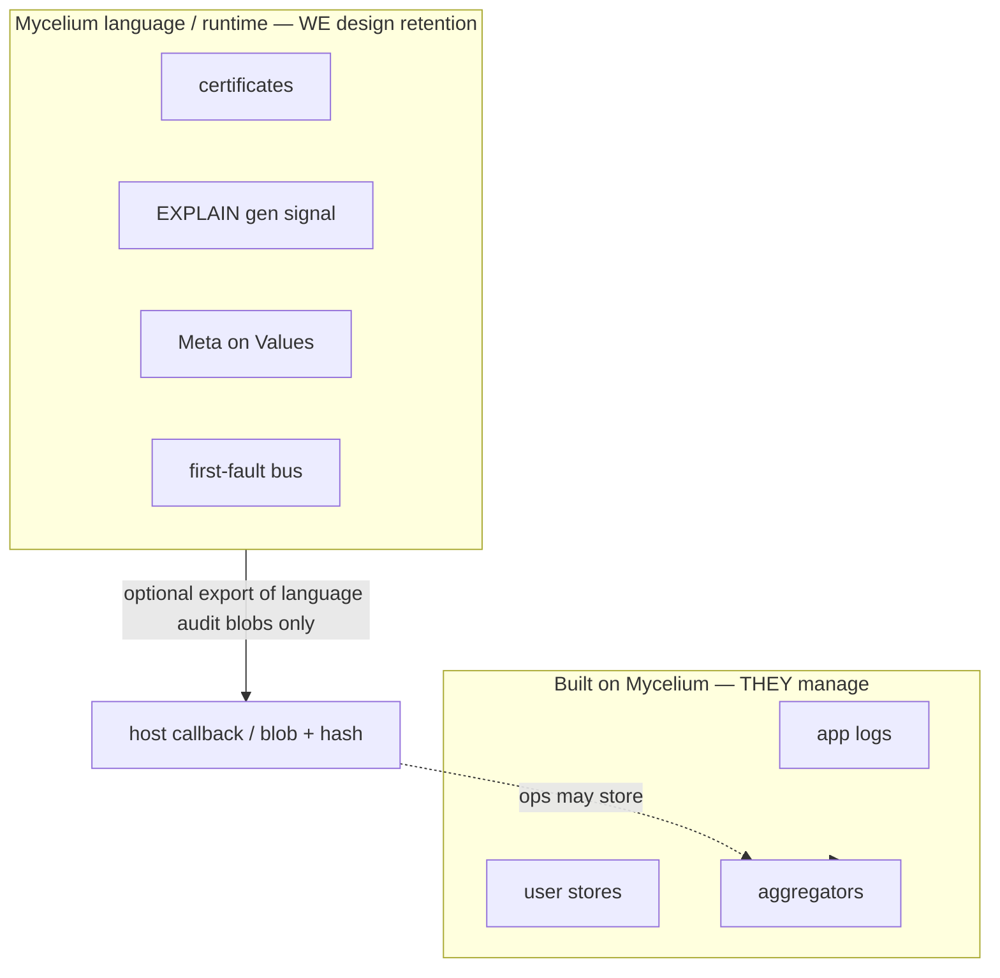
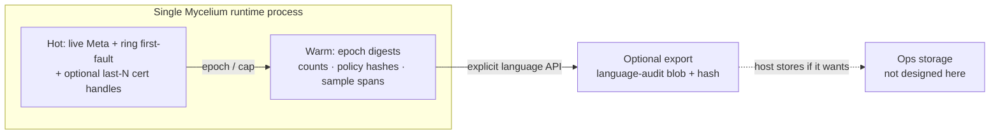
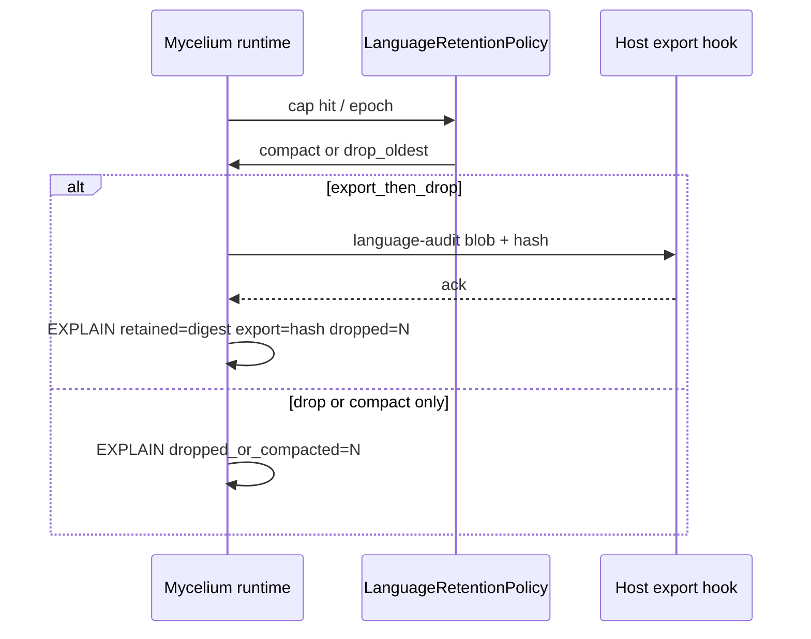

# Design pack 04 — Language/runtime internal ledgers & retention

| Field | Value |
|---|---|
| **Status** | **Draft** design package — not Accepted · not implement |
| **Pack** | 4 of 4 · with [01](./DESIGN-01-SWAPS-AND-POLICY.md) · [02](./DESIGN-02-TAGS-META-AND-CONTAINMENT.md) · [03](./DESIGN-03-MACHINERY-DIAGNOSTICS-AND-UX.md) |
| **Honesty** | Design positions `Declared` until ratified |
| **Grounds** | RFC-0034 (modes, gen≠consumption, cert emission) · RFC-0001 Meta · RFC-0002 certificates · RFC-0005 EXPLAIN · ADR-013 spores · pack 03 first-fault bus · G2 / VR-5 / KC-3 |

## 1. Scope boundary (read this first)

### In scope — **Mycelium language + its runtimes**

Anything the **language, checker, or runtime** itself allocates and may **grow without bound** over a
long process lifetime because of **language-defined** mechanisms:

- swap **certificates** and related cert storage
- **inspectability / EXPLAIN generation** buffers (the signal gen path)
- **Meta / provenance** payload carried on values (especially heavy Emp/Proven basis)
- **first-fault / diagnostic bus** rings if implemented as language machinery (pack 03)
- future **runtime** surfaces that are part of the language model (e.g. colony/hypha observability
  **if** they are language-defined event streams)

The **project** owns caps, mode defaults, compaction, and any **export hooks that only ship
language-internal audit blobs** so the process does not OOM itself.

### Out of scope — **what people build with Mycelium**

| Out | Who manages |
|---|---|
| Application logs (`println`, host syslog, user `std.io` sinks) | **App / ops** — cycle, ship, aggregate |
| Product analytics, business event stores | **App / ops** |
| User-defined append-only tables / files | **App** (stdlib may offer helpers later; not this pack’s duty) |
| CI artifacts, transpile `experiments/results`, git history | **Tooling / repo lifecycle** |
| Decision corpus (ADR/RFC/DN append-only) | **Docs discipline** (house rule #3) — not a runtime ledger |

**Rule of thumb:** if a byte exists only because the **language** ran a swap, minted Meta, or
recorded a first-fault, it is **in scope**. If a byte exists because the **application** chose to
log “user clicked buy,” it is **out of scope**.

## 2. Why this matters

Even with RFC-0034 mode gates (`fast` can skip cert emit; gen≠consumption), long-running **runtimes**
can still accumulate **language-internal** state:

| Risk | Example |
|---|---|
| Cert pile | Every `swap` under `certified` retains full cert objects forever in-process |
| Trace bloat | Inspectability signal kept in full for every op, not just first-fault |
| Meta bloat | Heavy provenance on intermediates never reclaimed |
| Bus → ledger | First-fault ring silently becomes unbounded history |
| Silent drop | Runtime frees audit state with no EXPLAIN (G2 break) |
| Quality kill | “Never drop language audit” forces certified-cost RAM for all long runs |

Ops offloading **app** logs does **not** fix these. The language must bound **its own** memory.

## 3. Inventory — language-internal perpetual surfaces only

| ID | Surface | Growth driver | Owner of retention design |
|---|---|---|---|
| **L1** | Swap **certificates** (RFC-0002) | Per successful/attempted swap | Runtime + CertMode |
| **L2** | **Inspectability signal** (EXPLAIN input) | Per selection / swap / mode event | Runtime; gen always ≥ middle; **storage** capped |
| **L3** | **Meta / provenance** on `Value` | Per value + meet | Runtime + mode (Emp/Proven omit in `fast`) |
| **L4** | **First-fault bus** (pack 03) | Per refuse (+ optional crumbs) | Runtime; **ring by default** |
| **L5** | **Live value graph** identity (content hash) | Live heap, not append log | GC of unreachable values (normal) |
| **L6** | **Spore / deploy identity** | Compile/deploy | Not a long-run process ledger (RFC-0034 §8) |
| **L7** | Future **language-defined** runtime event streams (colony/hypha if standardized) | Per language event | Same retention object as L1–L4 |

**Explicitly excluded from this table:** app logs, user files, external aggregators, CI outputs, docs.

## 4. Principles (language-internal only)

| # | Principle |
|---|---|
| **RP1** | **Generation ≠ retention** — may generate signal for first-fault without keeping every event forever (extends RFC-0034 §7) |
| **RP2** | **Mode-aware defaults** — `fast` keeps the minimum needed for honesty *in-process*; `certified` may keep more, still **bounded** |
| **RP3** | **Drop/compact of language audit is never silent** — EXPLAIN what was dropped or summarized |
| **RP4** | **First-fault ≠ full history** — default **ring/epoch** inside the runtime |
| **RP5** | **Optional export** of **language audit digests** for ops storage — not a substitute for app log pipelines |
| **RP6** | **No kernel log daemon** — retention is process-local policy + hooks; KC-3 |
| **RP7** | **No VR-5 lie** — summarizing/dropping never upgrades a grade or invents a checked cert |

## 5. Recommended model (Draft)

### 5.1 Hot / warm / cold — *inside the process* (and optional export)

| Tier | Language-internal contents | Bound |
|---|---|---|
| **Hot** | Meta on **live** values; last-N first-faults; optional last-N cert **handles** | Cap by count / bytes |
| **Warm** | Compacted digests of dropped hot data | Cap epochs |
| **Export** | Opaque **language-audit** blob + content hash after successful handoff | Leaves process; **host** owns disk |

**Not designed here:** how the host ships that blob to S3/ELK/etc. Only that the **runtime** can
produce a bounded export and then free warm/hot under EXPLAIN.

### 5.2 Defaults by `CertMode` (language-internal)

| Surface | `fast` | `balanced` | `certified` |
|---|---|---|---|
| **L1 certs** | No emit (today) | Emit unchecked; **hot ring / handles only** | Emit+check; still **capped** unless export policy retains digests |
| **L2 EXPLAIN gen** | ≥ middle gen; lean **storage** | medium storage | full materialization **on demand / export**, not infinite RAM |
| **L3 Emp/Proven Meta** | Omit heavy tags (today) | propagate unchecked | full track on live values; heavy basis not duplicated forever |
| **L4 first-fault** | Small ring | Larger ring | Ring + optional warm digest / export |

**`certified` ≠ unbounded RAM.** It means the runtime can produce **checked** audit evidence and
export digests that still verify — not that every cert stays mapped forever.

### 5.3 `LanguageRetentionPolicy` (Draft name)

A **runtime** policy (RFC-0005-shaped, scoped like `@certification`), **not** an app logging config:

| Field | Meaning |
|---|---|
| `hot_first_fault_cap` | Max first-fault records in-process |
| `hot_cert_handle_cap` | Max cert handles retained (0 = only live-attached) |
| `epoch` | Count or time for hot→warm |
| `on_overflow` | `drop_oldest` · `compact_to_digest` · `export_then_drop` |
| `export` | Optional host hook for **language-audit** blobs only |

Resolution: global / phylum / nodule (same story as CertMode).

Host may ignore the blob, store it, or aggregate it — **not our problem**. Our problem is the
runtime **frees or bounds** L1–L4 after a non-silent decision.

## 6. Per-surface directions (language only)

| Surface | Direction |
|---|---|
| **Certificates** | Prefer **handles** + content-addressed materialize-on-demand; do not pin every cert to every value for process life |
| **EXPLAIN signal** | Generate enough for first-fault; **store** digests + ring, not full trails by default |
| **Meta** | Live values carry **current** grade/mode/policy refs; heavy basis is shared/weak, not copied on every meet |
| **First-fault bus** | **Ring** required in any production profile; append-all is a non-default audit mode |
| **Future language event streams** | Must take `LanguageRetentionPolicy` at birth — no unbounded default |

## 7. Interaction with packs 01–03

| Pack | Link |
|---|---|
| **01** | Cert ambient must not imply infinite in-process cert history |
| **02** | Isolation EXPLAIN is a first-fault **kind**; digests must not claim Exact for dropped weak inputs |
| **03** | First-fault bus is L4; this pack bounds **lifetime** of those events |

## 8. Ranked options

| Rank | Option | Notes |
|---:|---|---|
| **1** | **LanguageRetentionPolicy + hot/warm + optional language-audit export + mode defaults** | **Recommend** |
| **2** | Only RFC-0034 mode gates (no process caps) | Incomplete for long-run certified processes |
| **3** | Unbounded in-process; hope app logs help | **Reject** — wrong layer |
| **REJECT** | Silent drop of language audit · certified = infinite retain · designing app log pipelines inside the language | |

## 9. Open questions for you

1. Default ring sizes for `fast` vs `certified`?
2. Must long-running `certified` processes set an explicit `LanguageRetentionPolicy`, or warn only?
3. Export hook: pure host FFI, language effect, or both?
4. Lossy warm digests OK if EXPLAIN states lossiness?
5. Any surface that claims “full in-process audit retained” under certified?

## 10. Work items (Declared — mint after free-id check)

| Pri | Item |
|---|---|
| **P0** | Empirical inventory of L1–L4 sizes in current Rust runtime under load |
| **P0** | Spec `LanguageRetentionPolicy` + EXPLAIN-of-drop/compact |
| **P1** | Cert handles + caps under certified long-run |
| **P1** | First-fault ring bounds (with pack 03 bus) |
| **P2** | Optional language-audit export hook (host stores) |
| **P2** | Future colony/hypha language events inherit same policy |

## 11. DoD

- [x] Scope limited to **language/runtime internal** ledgers
- [x] App/ops log offload explicitly **out of scope**
- [x] Mode-aware caps + non-silent drop/compact
- [x] Cross-links to 01–03
- [ ] Maintainer steers §9
- [ ] Implement after ratifiable capture

## 12. Reading order

1. This pack §§1–3 (boundary + inventory)
2. [DESIGN-03](./DESIGN-03-MACHINERY-DIAGNOSTICS-AND-UX.md) §3 (first-fault bus)
3. [DESIGN-01](./DESIGN-01-SWAPS-AND-POLICY.md) / [02](./DESIGN-02-TAGS-META-AND-CONTAINMENT.md) for cert & isolation interactions
